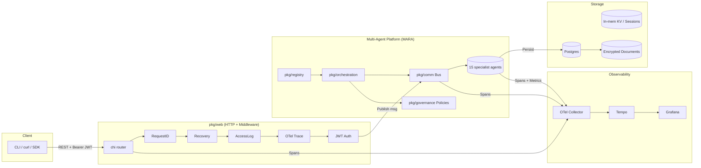
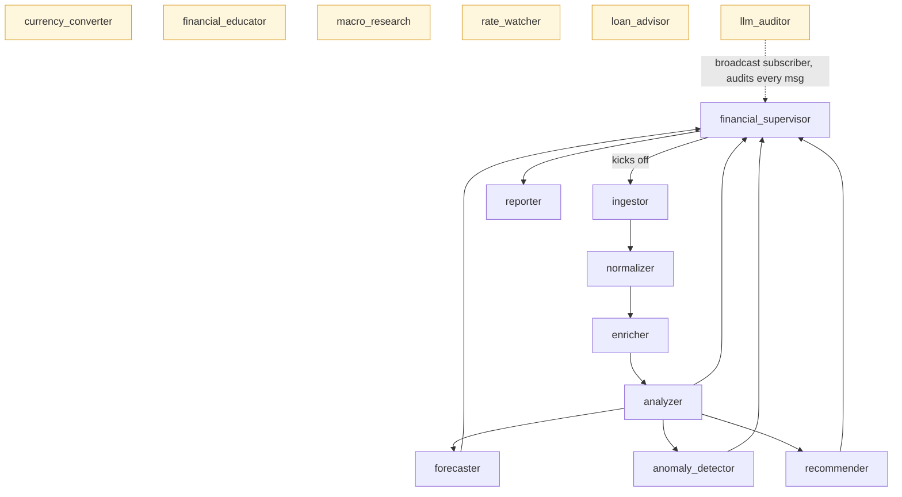
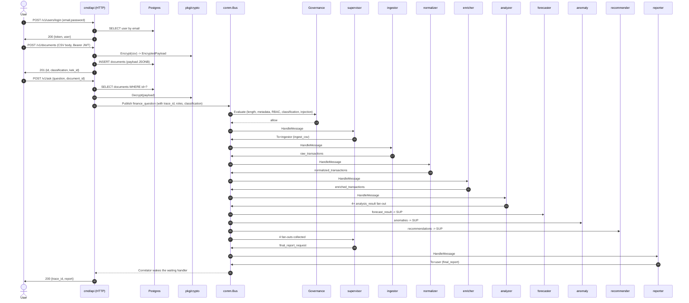
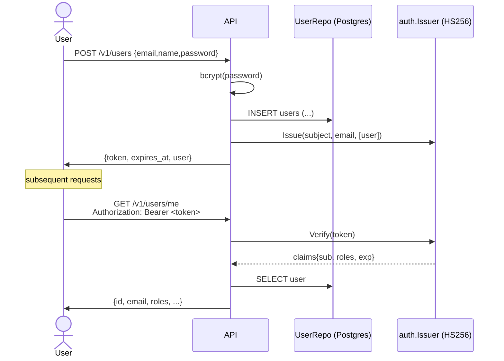
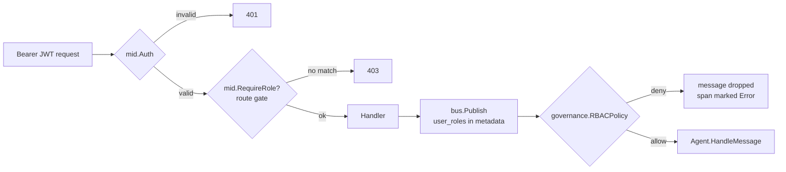
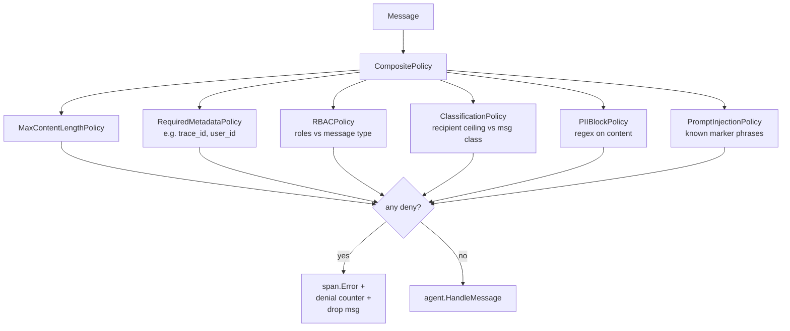
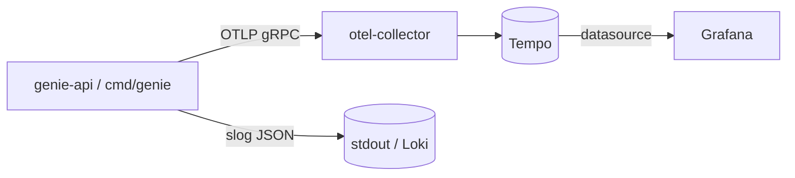
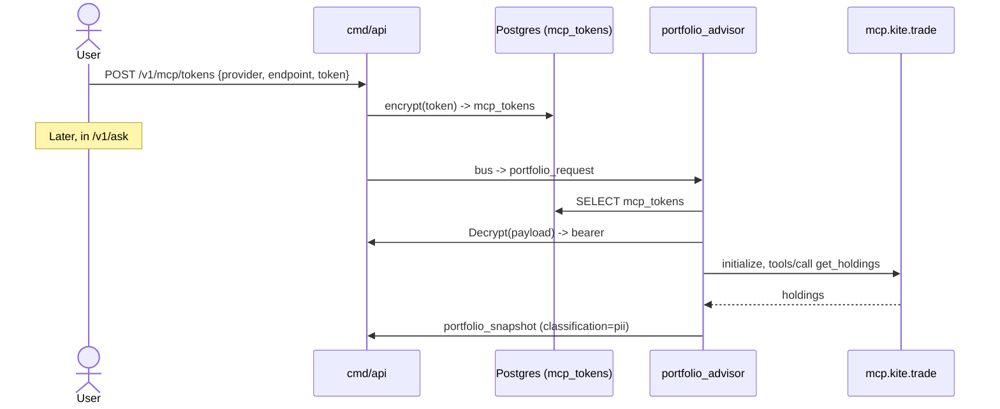
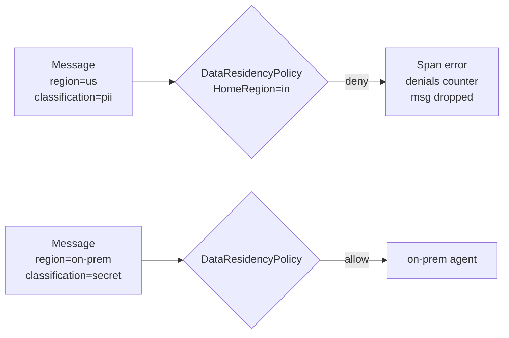
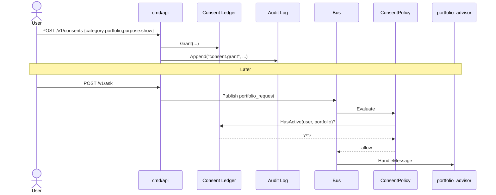

# Genie — AI Financial Assistant (Go)

> Open-source **AI financial assistant** in Go, built on Microsoft's
> [Multi-Agent Reference Architecture (MARA)](https://microsoft.github.io/multi-agent-reference-architecture/index.html).
> A thin HTTP edge gates requests with JWT + RBAC, persists encrypted
> documents in Postgres, and routes finance questions through a
> message-driven pipeline of specialist agents — fully traced via
> OpenTelemetry.


Repository: <https://github.com/c2siorg/genie>

---

## Table of contents

- [Why Genie](#why-genie)
- [System architecture](#system-architecture)
- [End-to-end finance flow](#end-to-end-finance-flow)
- [Repository layout](#repository-layout)
- [Quick start (CLI demo)](#quick-start-cli-demo)
- [Run the HTTP API with docker-compose](#run-the-http-api-with-docker-compose)
- [HTTP API: signup → upload → ask](#http-api-signup--upload--ask)
- [Authentication & Authorization](#authentication--authorization)
- [Document encryption](#document-encryption)
- [Governance & policies](#governance--policies)
- [Observability: traces, metrics, logs](#observability-traces-metrics-logs)
- [Scaffolding a new agent](#scaffolding-a-new-agent)
- [Testing](#testing)
- [Configuration reference](#configuration-reference)
- [Roadmap](#roadmap)

---

## Why Genie

Genie answers *"What should I do with my money?"* by combining deterministic
finance logic with specialist agents (ingestion, normalization, analysis,
forecasting, anomaly detection, recommendations). Every step is a message on
a bus, every message passes through governance, and every hop is traced.

The same shape — orchestrator + registry + bus + governance + memory +
observability + evaluation — is what MARA describes for production-grade
multi-agent systems.

---

## System architecture



### What lives where

| Layer | Package | Role |
| --- | --- | --- |
| Wire format | `pkg/protocol` | `Message`, `Classification`, metadata keys |
| Worker interface | `pkg/agent` | `Agent` + `Environment` |
| Discovery | `pkg/registry` | In-memory registry; capability lookup |
| Transport | `pkg/comm` | Pub/sub bus (in-mem; swap for Kafka/NATS) |
| Coordination | `pkg/orchestration` | Subscribes agents, enforces policy, traces |
| Safety | `pkg/governance` | Content length, required metadata, RBAC, classification, PII, prompt-injection |
| Memory | `pkg/memory` | Pluggable KV — local for sessions |
| Persistence | `pkg/storage/postgres` | pgx repos: users, accounts, encrypted documents, eval records |
| Crypto | `pkg/crypto` | Envelope AES-256-GCM + KEK resolvers |
| Auth | `pkg/auth` | JWT (HS256, stdlib), bcrypt, roles, claims |
| Observability | `pkg/observability` | slog + OTel traces/metrics; stdout or OTLP exporters |
| HTTP edge | `pkg/web` | chi router, middleware, handlers |
| Bus ↔ HTTP | `pkg/busio` | Correlator (await response by trace_id) |
| Agents | `agents/` | 15 specialists (see below) |

### The 15 specialists



Yellow agents are the ADK-inspired adjacent specialists (currency, educator,
macro, rate-watcher, loan-advisor, auditor). They are first-class citizens in
the registry but the standard "ask" flow uses the main grey pipeline.

---

## End-to-end finance flow

What happens when a user uploads a CSV and asks *"Where am I overspending?"*:



Trace context propagates across goroutines via `Message.Metadata` — the W3C
`traceparent` header is injected on publish and re-extracted by the
orchestrator before each agent runs, so the entire flow shows up as one
distributed trace in Tempo.

---

## Repository layout

```
genie/
├── cmd/
│   ├── api/           # HTTP service-edge binary (auth + RBAC + Postgres + OTLP)
│   ├── genie/         # CLI that runs the bus pipeline end-to-end in-process
│   ├── demo/          # original toy planner/executor/coordinator demo
│   └── scaffold/      # generates a new agent skeleton
├── agents/            # 15 specialist agents
├── pkg/
│   ├── protocol/      # Message + Classification
│   ├── agent/         # Agent + Environment
│   ├── registry/      # in-memory registry
│   ├── comm/          # in-memory pub/sub bus (with OTEL spans)
│   ├── orchestration/ # orchestrator (governance + tracing in the critical path)
│   ├── governance/    # policies: length, metadata, RBAC, classification, PII, injection
│   ├── memory/        # KV store interface + in-mem impl
│   ├── observability/ # slog + OTel (stdout or OTLP)
│   ├── eval/          # interaction records
│   ├── auth/          # JWT (stdlib), bcrypt, roles, claims
│   ├── crypto/        # envelope AES-GCM, KEK resolvers
│   ├── storage/postgres/ # pgxpool + migrations + repos
│   ├── busio/         # Correlator: await bus response by trace_id
│   └── web/           # chi router + middleware + HTTP handlers
├── data/sample.csv
├── deploy/local/      # tempo + otel-collector + grafana configs
├── docs/openapi.yaml  # full HTTP spec
├── tests/             # end-to-end integration test
├── Dockerfile
├── docker-compose.yaml
├── Makefile
└── .circleci/config.yml
```

**Module path:** `github.com/PratikDhanave/multi-agent-reference-architecture-go`

---

## Quick start (CLI demo)

No Postgres, no HTTP server. Runs the full bus pipeline in-process with
stdout OTel exporters.

```bash
go run ./cmd/genie
```

You should see structured logs and:

```text
=== FINAL REPORT ===
Genie Financial Report
Question: Where am I overspending vs last month?
Currency: INR
Income:  10000000 (minor units)
Expense: 3279800 (minor units)
Net:     6720200 (minor units)
Top categories: housing:rent, food:delivery, Utilities
Forecast: {...}
Recommendations: {...}
```

A `genie-traces.json` file is produced alongside the binary; it's a stream of
JSON-encoded OTel spans that mirror the sequence diagram above.

---

## Run the HTTP API with docker-compose

```bash
make compose-up
```

Brings up:

| Service | URL | Purpose |
| --- | --- | --- |
| `genie-api` | <http://localhost:8080> | the service |
| `postgres` | localhost:5432 | persistence (genie/genie/genie) |
| `otel-collector` | grpc :4317, http :4318 | receives OTLP |
| `tempo` | <http://localhost:3200> | trace backend |
| `grafana` | <http://localhost:3000> | UI (anonymous admin) |

In Grafana, open **Explore → Tempo** and run a trace search by service name
`genie-api`. Each Ask request appears as one distributed trace spanning the
HTTP server, the bus, governance, and every agent that handled a message.

Stop everything with `make compose-down`.

---

## HTTP API: signup → upload → ask

```bash
# 1) Sign up
TOKEN=$(curl -s -X POST localhost:8080/v1/users \
  -H 'Content-Type: application/json' \
  -d '{"email":"alice@example.com","name":"Alice","password":"hunter2hunter2"}' \
  | jq -r .token)

# 2) Upload an encrypted CSV
DOC_ID=$(curl -s -X POST 'localhost:8080/v1/documents?description=Jan%20statement&classification=pii' \
  -H "Authorization: Bearer $TOKEN" \
  --data-binary @data/sample.csv \
  | jq -r .id)

# 3) Ask Genie
curl -s -X POST localhost:8080/v1/ask \
  -H "Authorization: Bearer $TOKEN" \
  -H 'Content-Type: application/json' \
  -d "{\"question\":\"Where am I overspending?\",\"document_id\":\"$DOC_ID\"}" | jq .
```

Sample response:

```json
{
  "trace_id": "tr-1779514412090640000",
  "report": "Genie Financial Report\nQuestion: Where am I overspending?\nCurrency: INR\nIncome:  10000000 ...\n"
}
```

Full spec: [`docs/openapi.yaml`](docs/openapi.yaml). Render in any
OpenAPI viewer (Swagger UI, Redoc) for the interactive form.

---

## Authentication & Authorization

### Token lifecycle



- **JWT**: HS256 signed by `GENIE_JWT_SECRET`. Issued for 60 minutes.
  Implemented in stdlib (`pkg/auth/jwt.go`) to keep the security surface
  small and auditable — no third-party JWT library.
- **Passwords**: bcrypt via `golang.org/x/crypto/bcrypt`, default cost (10).
- **Roles**: `user` (default), `advisor`, `admin`. Stored as a Postgres
  `TEXT[]` column on `users`.

### Authorization at two layers

Genie enforces authz in two places — **before** the HTTP handler and
**before** the agent sees the message:



- `pkg/web/mid.Auth` verifies the JWT and pins `auth.Claims` onto the
  request context.
- `pkg/web/mid.RequireRole(roles...)` is an optional route-level gate.
- `pkg/governance.RBACPolicy` runs on the bus. It reads
  `metadata["user_roles"]` (set by the HTTP layer) and denies messages
  whose required roles are not held.
- `AdminBypass: true` lets `admin` skip every RBAC denial.

This means a compromised handler can't sneak data to an agent it isn't
authorized to talk to — the bus policy is still the gate.

---

## Document encryption

CSV uploads are encrypted before they reach Postgres. Genie uses an
**envelope encryption** scheme: each document gets a fresh data encryption
key (DEK), the DEK is wrapped with the active key encryption key (KEK), and
the wrapped DEK + ciphertext are stored together.

```mermaid
flowchart LR
    PT[CSV plaintext]
    DEK[(DEK 32 bytes,<br/>fresh per doc)]
    KEK[(KEK<br/>env / KMS)]
    CT[ciphertext]
    WDEK[wrapped DEK]
    JSON[EncryptedPayload JSON<br/>{kek_id, wrapped_dek, nonce, ciphertext}]

    PT --AES-256-GCM--> CT
    DEK --AES-256-GCM--> WDEK
    KEK -.wraps.-> DEK
    CT --> JSON
    WDEK --> JSON
    JSON --> PG[(documents.payload JSONB)]
```

- **Algorithm**: AES-256-GCM for both DEK encryption of the document and
  KEK wrapping of the DEK.
- **Local**: `pkg/crypto.EnvKeyResolver` reads the KEK from
  `GENIE_KEK_BASE64` (32 bytes, base64 encoded — generate with
  `openssl rand -base64 32`).
- **Production**: `pkg/crypto.KMSKeyResolver` is the production shape. Plug
  in any KMS by implementing the `KMSClient` interface (AWS KMS, GCP KMS,
  HashiCorp Vault Transit). Genie never sees the raw KEK in the prod path.
- **Storage**: `EncryptedPayload` is stored in `documents.payload` as
  JSONB. Decryption happens *only* in the `/v1/ask` flow, in memory, and
  the plaintext exits the process boundary on the bus marked
  `classification=pii`.
- **Description**: an arbitrary user-supplied label and a
  `classification` query parameter (`public | internal | pii | secret`) are
  stored alongside each document, so audits and governance policies can
  reason about content sensitivity without ever decrypting.

Key rotation is a future feature — the schema already accommodates it
(`kek_id` per row); decryption first asks the resolver if it can serve that
KEK id, otherwise rejects.

---

## Governance & policies

Every message that crosses the bus is evaluated by a composite policy
**before** the destination agent's `HandleMessage` runs.



Policies are deliberately small and composable. The composite denies on the
first deny and reports the reason via OTel span attributes and the
`genie.governance.denials` counter.

To add a policy, implement:

```go
type Policy interface {
    Evaluate(ctx context.Context, msg protocol.Message) (PolicyResult, error)
}
```

and put it into the composite at startup.

---

## Observability: traces, metrics, logs



- **Traces**: spans around `http <method> <path>`, `governance.evaluate`,
  `bus.publish`, `agent.handle`. Trace context is propagated through
  `Message.Metadata` so async hops stay linked.
- **Metrics**:
  - `genie.bus.messages_published`
  - `genie.agent.messages_handled`
  - `genie.governance.denials`
  - `genie.agent.errors`
  - `genie.agent.handle_duration_ms` (histogram)
- **Logs**: structured slog (`pkg/observability.SlogLogger`). Use the
  `LogAttrs` method for hot paths.

Switch between exporters:

| Mode | When | Set |
| --- | --- | --- |
| stdout | CLI demo (`cmd/genie`) | nothing — default |
| OTLP gRPC | service (`cmd/api`) | `OTEL_EXPORTER_OTLP_ENDPOINT=otel-collector:4317` (compose does this for you) |

---

## Scaffolding a new agent

Add a "tax estimator" agent without writing the boilerplate:

```bash
make scaffold name=tax_estimator cap=estimate_tax \
  in=analysis_result out=tax_estimate next=financial_supervisor
```

Genie generates:

```
agents/tax_estimator/
  tax_estimator.go      # full Agent implementation skeleton
  tax_estimator_test.go # passing table-driven test
```

It also prints the line you need to add to `cmd/api/main.go` and
`cmd/genie/main.go`:

```go
register(tax_estimator.New())
```

Fill in `HandleMessage`'s TODO with your domain logic.

---

## Testing

```bash
make test
```

This runs:

- Unit tests for every agent (table-driven, no I/O).
- `pkg/auth` JWT + bcrypt roundtrips.
- `pkg/crypto` envelope encryption roundtrips (with env KEK).
- `pkg/governance` policy decisions.
- End-to-end pipeline through the in-memory bus (`tests/integration_test.go`).

Postgres-backed integration tests are not wired in (no testcontainers
dependency yet). The repos are exposed via interfaces (`UserRepo`,
`AccountRepo`, `DocumentRepo`) so handler-level tests can substitute fakes.

---

## Configuration reference

| Variable | Required by | Description |
| --- | --- | --- |
| `GENIE_HTTP_ADDR` | `cmd/api` | listen address (default `:8080`) |
| `GENIE_JWT_SECRET` | `cmd/api` | HS256 secret bytes |
| `GENIE_KEK_BASE64` | `cmd/api` | 32-byte base64-encoded KEK |
| `GENIE_DB_DSN` | `cmd/api` | Postgres DSN |
| `OTEL_EXPORTER_OTLP_ENDPOINT` | `cmd/api` (optional) | enables OTLP exporter |
| `GENIE_OTEL_INSECURE` | `cmd/api` (optional) | `"true"` to skip TLS on OTLP |
| `GENIE_LLM` | `cmd/api` (optional) | `"mock"` (default) or `"ollama"` — selects the LLM stack |
| `GENIE_OLLAMA_URL` | `cmd/api` (when ollama) | Ollama HTTP root, default `http://localhost:11434` |
| `GENIE_OLLAMA_CHAT` | `cmd/api` (when ollama) | chat model id, default `llama3.2:1b` |
| `GENIE_OLLAMA_EMBED` | `cmd/api` (when ollama) | embedding model id, default `nomic-embed-text` |
| `GENIE_LLM_BUDGET` | `cmd/api` (optional) | daily token cap per principal, default `1000000` |
| `GENIE_LLM_CACHE_TTL` | `cmd/api` (optional) | response cache TTL in seconds, default `600` |
| `GENIE_LLM_TIMEOUT` | `cmd/api` (optional) | per-call timeout in seconds, default `30` |
| `GENIE_LLM_CIRCUIT` | `cmd/api` (optional) | consecutive-error threshold for the circuit breaker, default `5` |

Generate a key locally:

```bash
openssl rand -base64 32
```

### Run with Ollama (on-prem inference)

When `GENIE_LLM=ollama`, `cmd/api` builds the production wrapper stack
`Ollama → Cost → Cache → Budget → Deadline → Circuit` and switches the RAG
embedder to `nomic-embed-text` via Ollama. Both `pkg/llm.OllamaProvider` and
`pkg/rag.OllamaEmbedder` already exist; the factory in
[cmd/api/llmstack.go](cmd/api/llmstack.go) just wires them.

```bash
# Local development (without Docker):
brew install ollama        # or any platform installer
ollama serve &
ollama pull llama3.2:1b    # ~1GB, runs on a laptop CPU
ollama pull nomic-embed-text

export GENIE_LLM=ollama
export GENIE_OLLAMA_CHAT=llama3.2:1b
export GENIE_OLLAMA_EMBED=nomic-embed-text
go run ./cmd/api
```

```bash
# Or with the full Docker stack — Ollama is now a first-class compose service:
make compose-up
# The `ollama-pull` init container warms the model cache once; subsequent
# runs reuse the volume.
```

Verify the stack is live:

```bash
curl -s localhost:11434/api/tags | jq '.models[].name'
# "llama3.2:1b"
# "nomic-embed-text:latest"

curl -s localhost:8080/readyz | jq .
# {"status":"ok"}   # only 200s when Ollama responds to /api/tags
```

Mock mode (default, used by CI and `cmd/genie`) bypasses Ollama entirely and
uses `llm.Mock` + `rag.HashEmbedder`, so the demo runs with zero external
dependencies.

---

## MCP integration (Zerodha Kite + custom servers)

Genie speaks the **Model Context Protocol** in both directions:

- **As a client** — `pkg/mcp/client` connects to any MCP server that speaks
  streamable HTTP. The `portfolio_advisor` agent uses it to call
  [Zerodha's hosted Kite MCP](https://mcp.kite.trade/mcp) for the user's
  holdings and positions.
- **As a server** — `pkg/mcp/server` exposes selected read-only agents
  (`financial_educator`, `macro_research`, `rate_watcher`) as MCP tools
  under `/mcp`. Claude Desktop, Cursor, or any MCP client can call them.

### Linking a Zerodha account

```bash
# Tokens come from the Kite MCP login flow (mcp.kite.trade); paste the
# session token Genie should store. The plaintext only lives in memory
# long enough to be encrypted via pkg/crypto.
curl -s -X POST localhost:8080/v1/mcp/tokens \
  -H "Authorization: Bearer $TOKEN" \
  -H 'Content-Type: application/json' \
  -d '{
    "provider": "zerodha-kite",
    "endpoint": "https://mcp.kite.trade/mcp",
    "token": "PASTE-SESSION-TOKEN-HERE"
  }'
```

Once a token is on file, `portfolio_advisor` will fetch holdings and
positions whenever the supervisor dispatches a `portfolio_request`.

### MCP flow



---

## Sovereign AI (data residency)

Sovereign-AI deployments — Indian or otherwise — require that PII and
payment data stay inside national borders. Genie enforces this with two
primitives:

- **`pkg/sovereignty.ProviderRegistry`** is the allowlist of external
  providers (LLMs, MCP servers) and the classifications each may receive.
- **`pkg/governance.DataResidencyPolicy`** runs on the bus. PII / Secret
  messages whose region tag is anything other than `HomeRegion` or
  `on-prem` are denied. Public/Internal messages get a configurable
  exception.



Configure the home region in `cmd/api` (`sovereignty.RegionIN` by default
for an India deployment). Tag outbound providers like this:

```go
reg := sovereignty.NewRegistry()
reg.Register(sovereignty.Provider{
    Name:                   "anthropic",
    Region:                 sovereignty.RegionUS,
    AllowedClassifications: []protocol.Classification{protocol.ClassPublic, protocol.ClassInternal},
})
```

A local LLM provider (e.g. Ollama) registered with
`Region: sovereignty.RegionOnPrem, AllowedClassifications: {public, internal, pii, secret}`
is the right destination for PII reasoning.

---

## RBI / DPDP-aligned compliance

The `pkg/compliance` package adds the three primitives the Reserve Bank of
India's cyber-resilience framework and the DPDP Act, 2023 expect:

| Primitive | Where | What it does |
| --- | --- | --- |
| **Consent ledger** | `compliance.Ledger` + `governance.ConsentPolicy` | Records explicit per-category consent (`transactions`, `portfolio`, `recommendations`, `third_party_share`). The policy denies messages whose type requires a category with no active consent. |
| **Tamper-evident audit log** | `compliance.AuditLog` (SHA-256 hash chain) | Append-only. `Verify()` walks the chain and surfaces any mutation. |
| **Explainability** | `governance.ExplainabilityPolicy` | Denies recommender / advisor outputs that omit a `rationale` field — RBI guidance for automated lending decisions. |

These slot into the same `governance.NewComposite(...)` stack as the
existing policies, so every message hits them before reaching an agent.

### Consent + audit flow



(The HTTP endpoint to grant consent is on the roadmap; for now the
`Ledger` interface is wired into the policy and seeded programmatically in
`cmd/api`. Adding the endpoint is a five-line handler.)

---

## Live profiling (pprof)

The standard library pprof endpoints are exposed under `/debug/pprof/*`
behind JWT auth + the `admin` role. Hit them like this:

```bash
# Get an admin token (seeded via Postgres or via a manual update).
go tool pprof "localhost:8080/debug/pprof/heap?seconds=30" \
  -header "Authorization=Bearer $ADMIN_TOKEN"
```

For local debugging without a token, call `web.StartLocalPprof("127.0.0.1:6060")`
from `cmd/api` (commented-out hook). It binds to localhost only so a
container running `genie-api` doesn't accidentally expose pprof to the
network.

---

## LLM Provider abstraction

`pkg/llm.Provider` is the seam where Anthropic / Gemini / OpenAI / Ollama
plug in. `Mock` is shipped today; production providers are a future PR.
The `Provider.Region()` method composes with `sovereignty` so the
DataResidencyPolicy can refuse PII routing to an out-of-region provider
without the agent having to know.

```go
type Provider interface {
    Name() string
    Region() string
    Complete(ctx context.Context, req CompletionRequest) (CompletionResponse, error)
}
```

---

## AI concept inventory

Beyond MARA, MCP and the RBI alignment, Genie now ships a layered set of AI
primitives. Each item is small, swappable, and behind a stable interface.

| Concept | Where | Notes |
| --- | --- | --- |
| **RAG** | [`pkg/rag`](pkg/rag/) | `Embedder` + `VectorStore` + `Index`; `HashEmbedder` (deterministic) and `OllamaEmbedder` (on-prem); in-mem store for the demo, pgvector slot kept open. |
| **Citations on outputs** | [`agents/educator`](agents/educator/educator.go) | `educator.WithRAG(idx)` makes glossary answers carry top-K source chunks; the 7 Sutras are seeded into the index at boot. |
| **Output-schema enforcement** | [`pkg/schema`](pkg/schema/) + `governance.SchemaPolicy` | Tiny pure-Go JSON-Schema subset; deny messages whose Type maps to a registered schema and whose Content fails validation. |
| **Constitutional AI** | [`pkg/constitution`](pkg/constitution/), [`config/constitution.yaml`](config/constitution.yaml) | YAML-loaded 7-Sutra system prompt; `Critique(...)` scores outputs 0..10 against the constitution. |
| **LLM-as-judge auditor** | [`agents/auditor`](agents/auditor/auditor.go) | `auditor.WithJudge(provider, constitution, model)` scores every broadcast message and records the verdict in `pkg/eval`. |
| **SSE streaming** | [`pkg/web/handlers/ask_stream.go`](pkg/web/handlers/ask_stream.go), [`pkg/busio/stream.go`](pkg/busio/stream.go) | `POST /v1/ask/stream` emits one `agent.handle` event per bus hop, then a final `report` event. |
| **Token budgeting** | [`pkg/llm.BudgetedProvider`](pkg/llm/budget.go) | Wraps any `Provider`; daily per-principal cap; `ErrBudgetExceeded` when over. |
| **Reasoning patterns** | [`pkg/reasoning`](pkg/reasoning/) | `CoTPrompt`, `SplitCoT`, `Reflect`, and a textbook `ReAct(...)` loop. |
| **Account Aggregator** | [`agents/aa_fetcher`](agents/aa_fetcher/) | Sahamati `FIClient` interface; `InMemoryFIClient` fixture; gated by `compliance.Ledger` for consent. |
| **Indic ASR/TTS** | [`agents/voice`](agents/voice/) | `VoiceProvider` interface (`Transcribe`/`Synthesise`); `EchoProvider` for tests; plug Bhashini/Whisper later. |
| **Tax estimator (India)** | [`agents/tax_estimator`](agents/tax_estimator/) | New regime (FY 2024-25) + old regime slabs + cess; 87A rebate baked in for ≤ ₹7L. |

### Quick examples

```bash
# Stream a finance question (SSE) — needs an authenticated bearer.
curl -N -X POST localhost:8080/v1/ask/stream \
  -H "Authorization: Bearer $TOKEN" \
  -H 'Content-Type: application/json' \
  -d '{"question":"Where am I overspending?","document_id":"...UUID..."}'
# event: trace
# data: tr-...
#
# event: agent.handle
# data: {"from":"ingestor","to":"normalizer","type":"raw_transactions",...}
# ...
# event: report
# data: Genie Financial Report ...
```

```go
// Constitutional critique.
cst, _ := constitution.Load("config/constitution.yaml")
verdict, _ := cst.Critique(ctx, provider, "model-id", "<candidate output>")
// verdict.Score in [0,10], verdict.Reasoning is one line.
```

```go
// ReAct loop with one tool.
result, _ := reasoning.ReAct(ctx, provider, "model", "rate finder", "rate?", []reasoning.Tool{{
    Name: "rate",
    Run:  func(_ context.Context, _ string) (string, error) { return "83.0", nil },
}}, 3)
```

---

## RBI FREE-AI alignment

The August 2025 [RBI Framework for Responsible and Ethical Enablement of AI
(FREE-AI)](https://rbidocs.rbi.org.in/rdocs/PublicationReport/Pdfs/FREEAIR130820250A24FF2D4578453F824C72ED9F5D5851.PDF)
sets out 7 Sutras, 6 Pillars and 26 Recommendations. Genie maps onto the report
as follows. Items marked ✅ are implemented in this repo; 🟡 are partial; — is
outside Genie's scope (regulator or sector-level action).

| Pillar | Rec | Title | Genie evidence |
| --- | --- | --- | --- |
| Infra | 1 | Financial sector data infrastructure | — |
| Infra | 2 | AI Innovation Sandbox | ✅ `cmd/genie` runs the pipeline locally without any external system |
| Infra | 3 | Incentives + funding | — |
| Infra | 4 | Indigenous AI models | ✅ `pkg/llm.OllamaProvider` for on-prem inference; `Provider.Region()` lets the residency policy refuse cross-border PII |
| Infra | 5 | AI + DPI | — |
| Policy | 6 | Adaptive policies | ✅ `pkg/policy` loads the board-approved YAML; engineers ship the loader, the board owns the values |
| Policy | 7 | Affirmative-action compliance | — |
| Policy | 8 | Graded liability framework | ✅ `pkg/incidents.Grade()` classifies first-offense vs repeat using a configurable lookback window |
| Policy | 9 | AI Standing Committee | — |
| Capacity | 10–13 | Capacity building, sharing, awards | — |
| Governance | 14 | Board-approved AI policy | ✅ [`config/ai-policy.example.yaml`](config/ai-policy.example.yaml) + `pkg/policy.AIPolicy` (mirrors Annexure V) |
| Governance | 15 | Data lifecycle governance | ✅ `pkg/crypto` envelope encryption + `expires_at` columns + `db.StartRetentionJob` purge every 6h |
| Governance | 16 | AI system governance + autonomous controls | ✅ Per-agent `RiskLevel()`, supervisor session lifecycle, autonomous agents (portfolio_advisor) classified High |
| Governance | 17 | AI in product approval | 🟡 inventory + risk class give the data; explicit approval workflow on the roadmap |
| Protection | 18 | Consumer protection | ✅ `Ask` handler returns the `ai_disclosure` banner so users always know they're interacting with AI |
| Protection | 19 | Cybersecurity measures | ✅ JWT + RBAC + classification + PII + injection + rate-limit middleware (`pkg/web/mid.RateLimit`) |
| Protection | 20 | Red teaming | ✅ `cmd/red-team` + `make red-team` runs the adversarial probe corpus against the composite policy |
| Protection | 21 | BCP for AI systems | ✅ `agents/fallback.NewFor(...)` + `Orchestrator.SetFallback(...)` routes failed messages to a human-review notifier |
| Protection | 22 | AI incident reporting (Annexure VI) | ✅ `pkg/incidents` + Postgres `incidents` table + `POST /v1/incidents`; orchestrator hooks auto-record policy denials and agent errors |
| Assurance | 23 | AI Inventory + sector-wide repository | ✅ `GET /v1/ai-inventory` lists every registered agent with risk class, capabilities, fallback presence |
| Assurance | 24 | AI audit framework | 🟡 `agents/auditor` records each bus message; periodic third-party audit cadence on the roadmap |
| Assurance | 25 | AI disclosures | ✅ `GET /v1/disclosures` returns policy version, sutras, agent counts by risk class |
| Assurance | 26 | AI Compliance Toolkit | ✅ `pkg/toolkit` ships a default Scorecard with one check per Sutra |

### Running the RBI-aligned tooling

```bash
# Red-team the board-approved policy (Rec 20)
make red-team

# Pull the public disclosures surface (Rec 25) — no auth required
curl localhost:8080/v1/disclosures | jq .

# List AI inventory (Rec 23) — admin only
curl -H "Authorization: Bearer $ADMIN_TOKEN" localhost:8080/v1/ai-inventory | jq .

# Submit an incident (Rec 22, Annexure VI form)
curl -X POST localhost:8080/v1/incidents \
  -H "Authorization: Bearer $TOKEN" \
  -H 'Content-Type: application/json' \
  -d '{"use_case":"credit","description":"model refused valid applicant","failure_mode":"bias","severity":"moderate"}'
```

### The board owns the policy

`config/ai-policy.example.yaml` is the Annexure V outline. Bump `version` and
`board_approved_on` on every change. Engineers never edit the active values —
only the loader (`pkg/policy`) and the policies (`pkg/governance`).

---

## Roadmap

| Phase | Status | Notes |
| --- | --- | --- |
| Multi-agent platform | ✅ | MARA-aligned, message-driven |
| 9 core finance agents | ✅ | ingestor → reporter |
| 6 ADK-inspired agents | ✅ | currency, educator, macro, rate-watcher, loan, auditor |
| OTel traces + metrics | ✅ | stdout + OTLP exporters |
| HTTP API, JWT auth, RBAC | ✅ | chi + stdlib JWT |
| Postgres persistence | ✅ | pgx + embedded migrations |
| Envelope encryption (AES-GCM) | ✅ | env / KMS resolvers |
| Tempo + Grafana via compose | ✅ | local stack |
| CircleCI pipeline | ✅ | test + docker build |
| Scaffold generator | ✅ | `make scaffold name=...` |
| OpenAPI spec | ✅ | `docs/openapi.yaml` |
| MCP client (Zerodha Kite) | ✅ | `portfolio_advisor` calls `mcp.kite.trade` |
| MCP server exposing Genie tools | ✅ | `/mcp` JSON-RPC over HTTP |
| Sovereign-AI data residency | ✅ | `pkg/sovereignty` + `DataResidencyPolicy` |
| Consent ledger + audit chain | ✅ | `pkg/compliance` (in-mem; Postgres tables ready) |
| Explainability policy | ✅ | rationale required on recommender output |
| pprof under admin | ✅ | `/debug/pprof/*` |
| LLM Provider interface + Mock | ✅ | Anthropic / Gemini / OpenAI providers pending |
| Kubernetes manifests | 🚧 | kustomize overlays for local/prod |
| Postgres-backed eval store | 🚧 | currently in-memory |
| Key rotation | 🚧 | schema ready (`kek_id`), logic pending |
| Real LLM providers + Ollama | 🚧 | only `llm.Mock` today |
| Account Aggregator (India) integration | 🚧 | natural extension of MCP client |
| Vector store / RAG knowledge layer | 🚧 | future tool integration |

---

## License

MIT. See [LICENSE](LICENSE) when added.

---

## References

- [Multi-Agent Reference Architecture](https://microsoft.github.io/multi-agent-reference-architecture/index.html)
- [Building blocks](https://microsoft.github.io/multi-agent-reference-architecture/docs/building-blocks/Building-Blocks.html)
- [Agents communication](https://microsoft.github.io/multi-agent-reference-architecture/docs/agents-communication/Agents-Communication.html)
- [Observability](https://microsoft.github.io/multi-agent-reference-architecture/docs/observability/Observability.html)
- [Security](https://microsoft.github.io/multi-agent-reference-architecture/docs/security/Security.html)
- [Google ADK samples — agent categories](https://github.com/google/adk-samples/tree/main/python/agents)
