# Genie — AI Financial Assistant (Go)

> Open-source **AI financial assistant** in Go, built on Microsoft's
> [Multi-Agent Reference Architecture (MARA)](https://microsoft.github.io/multi-agent-reference-architecture/index.html)
> and aligned with the **RBI FREE-AI** report. Speaks **MCP** and **A2A**,
> ships **Ollama on-prem** by default, and bundles a full **GenAI engineering**
> layer (RAG, prompts, reasoning, memory, eval, safety, privacy). Ships
> **60+ specialist agents** covering retail finance, SME lending, KYC,
> bancassurance, fraud, treasury, payments, and cyber.


Repository: <https://github.com/c2siorg/genie>

> **📚 Detailed documentation:** every agent, every package, every protocol, every endpoint, and every FREE-AI recommendation has a dedicated page in [`docs/`](docs/). Start at [docs/README.md](docs/README.md).
>
> Quick links: [architecture](docs/architecture.md) · [operations](docs/operations.md) · [HTTP API](docs/api.md) · [protocols](docs/protocols.md) · [FREE-AI mapping](docs/free-ai-mapping.md) · [agents](docs/agents/README.md) · [packages](docs/packages/README.md)

---

## Table of contents

- [Why Genie](#why-genie)
- [System architecture](#system-architecture)
- [The 60+ specialist agents](#the-60-specialist-agents)
- [Domain expansion: fraud, lending, tax, treasury, SME](#domain-expansion-fraud-lending-tax-treasury-sme)
- [ADK-inspired extension agents](#adk-inspired-extension-agents)
- [End-to-end finance flow](#end-to-end-finance-flow)
- [Repository layout](#repository-layout)
- [Quick start (CLI demo)](#quick-start-cli-demo)
- [Run the full stack via docker-compose](#run-the-full-stack-via-docker-compose)
- [HTTP API: signup → upload → ask](#http-api-signup--upload--ask)
- [Authentication & Authorization](#authentication--authorization)
- [Document encryption](#document-encryption)
- [Governance & policies](#governance--policies)
- [Observability: traces, metrics, logs](#observability-traces-metrics-logs)
- [LLM providers](#llm-providers)
- [Vision adapter + receipt OCR](#vision-adapter--receipt-ocr)
- [Retrieval: hybrid RAG + GraphRAG + pgvector](#retrieval-hybrid-rag--graphrag--pgvector)
- [Reasoning patterns](#reasoning-patterns)
- [Memory: semantic + episodic + summarisation](#memory-semantic--episodic--summarisation)
- [Evaluation](#evaluation)
- [Safety](#safety)
- [Workflow: DAG + Saga + HITL](#workflow-dag--saga--hitl)
- [MCP integration (Zerodha Kite)](#mcp-integration-zerodha-kite)
- [Agent-to-Agent (A2A) protocol](#agent-to-agent-a2a-protocol)
- [OAuth device flow for MCP onboarding](#oauth-device-flow-for-mcp-onboarding)
- [OAuth 2.1 + WebAuthn passwordless login](#oauth-21--webauthn-passwordless-login)
- [Sovereign AI: data residency + on-prem inference](#sovereign-ai-data-residency--on-prem-inference)
- [RBI FREE-AI alignment](#rbi-free-ai-alignment)
- [Federated learning + secure aggregation](#federated-learning--secure-aggregation)
- [AIBOM + CycloneDX + Sigstore signing](#aibom--cyclonedx--sigstore-signing)
- [Identity: DIDs + Verifiable Credentials](#identity-dids--verifiable-credentials)
- [CloudEvents + AsyncAPI + OpenInference](#cloudevents--asyncapi--openinference)
- [Live profiling (pprof)](#live-profiling-pprof)
- [Scaffolding a new agent](#scaffolding-a-new-agent)
- [Testing & quality gates](#testing--quality-gates)
- [Configuration reference](#configuration-reference)
- [AI concept inventory](#ai-concept-inventory)
- [Roadmap](#roadmap)
- [References](#references)

---

## Why Genie

Genie answers *"What should I do with my money?"* by combining deterministic
finance logic with specialist agents (ingestion → normalisation → analysis →
forecasting → anomaly detection → recommendations). Every step is a message
on a bus, every message passes through governance, every hop is traced.

The same shape — orchestrator + registry + bus + governance + memory +
observability + evaluation — is what MARA prescribes for production-grade
multi-agent systems, and what the RBI FREE-AI report (Aug 2025) maps to its
7 Sutras + 6 Pillars + 26 Recommendations.

---

## System architecture

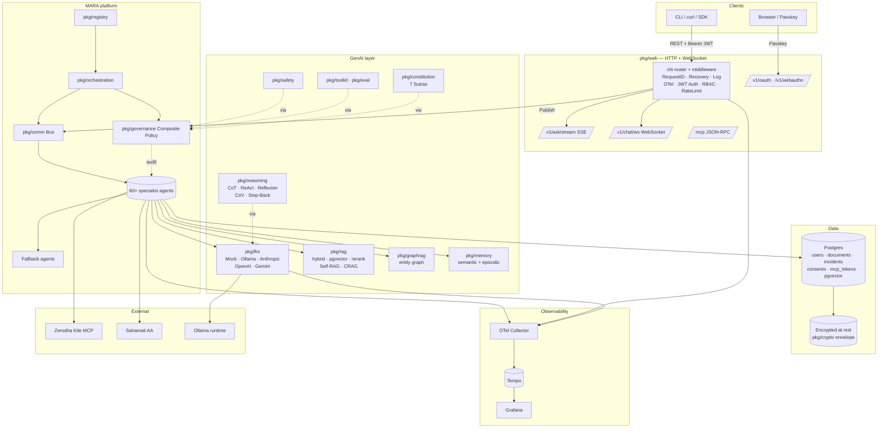

### What lives where

| Layer | Package | Role |
| --- | --- | --- |
| Wire format | `pkg/protocol` | `Message`, `Classification`, metadata keys |
| Worker interface | `pkg/agent` | `Agent` + `Environment` + `RiskClass` |
| Discovery | `pkg/registry` | In-memory registry; capability lookup |
| Transport | `pkg/comm` | Pub/sub bus (in-mem; swap for Kafka/NATS) |
| Coordination | `pkg/orchestration` | Subscribes agents, enforces policy, traces, fallback |
| Safety | `pkg/governance` | Composite: length, metadata, RBAC, classification, residency, consent, PII, injection, schema, explainability |
| Memory | `pkg/memory` | Pluggable KV + semantic + episodic + LLM summariser |
| Persistence | `pkg/storage/postgres` | pgx repos: users, accounts, documents, mcp_tokens, incidents, consents, audit_log, rag_embeddings |
| Crypto | `pkg/crypto` | Envelope AES-256-GCM + KEK resolvers |
| Auth | `pkg/auth` | JWT + bcrypt + OAuth 2.1 + Device flow + WebAuthn |
| Observability | `pkg/observability` | slog + OTel; stdout/OTLP exporters; OpenInference attrs |
| HTTP edge | `pkg/web` | chi router + middleware + handlers + SSE + WebSocket + pprof |
| Bus ↔ HTTP | `pkg/busio` | Correlator + EventTap for streaming |
| LLM | `pkg/llm` | Provider + 5 impls + Cost/Cache/Router/Shadow/Circuit/Deadline/Budget wrappers |
| RAG | `pkg/rag` (+ `pgvector`, `rerank`) | Hybrid retrieval, parent-child, time-decay, HyDE, Self-RAG, CRAG |
| Graph | `pkg/graphrag` | Entity graph over transactions/merchants |
| Reasoning | `pkg/reasoning` | CoT, ReAct, Reflexion, CoV, Step-Back, Semantic Router |
| Prompts | `pkg/prompt` | Versioned registry + few-shot + Thompson bandit |
| Constitution | `pkg/constitution` | 7-Sutra system prompt + LLM-as-judge critique |
| Schema | `pkg/schema` | JSON-Schema validator |
| Eval | `pkg/eval/{ragas,checklist,drift,hallucination,elo}` | Quality metrics |
| Safety | `pkg/safety` | Jailbreak, topic, toxicity, bias |
| Synth + Feedback | `pkg/synth` + `pkg/dpo` | LLM-driven synth + RLAIF feedback + JSONL export |
| Loaders | `pkg/loader` | PDF/HTML/DOCX + entity extraction |
| Toolkit | `pkg/toolkit` | 7-Sutra compliance Scorecard |
| Workflow | `pkg/workflow` | DAG + Saga + HITL + event-sourced log |
| Privacy | `pkg/privacy` | HMAC tokenisation + Laplace/Gaussian DP noise |
| Identity | `pkg/identity` | did:key + W3C Verifiable Credentials |
| AIBOM | `pkg/aibom` | Manifest + CycloneDX 1.6 + Ed25519 signing |
| MCP | `pkg/mcp` | Client + server (JSON-RPC streamable HTTP) |
| A2A | `pkg/a2a` | Agent-to-Agent client + server |
| CloudEvents | `pkg/cloudevents` | CloudEvents 1.0 envelope |
| Sovereignty | `pkg/sovereignty` | Region tags + provider registry |
| Compliance | `pkg/compliance` | Consent ledger + tamper-evident audit log + graded liability |
| Incidents | `pkg/incidents` | Annexure VI form + auto-record |
| Policy | `pkg/policy` | Board-approved AI policy YAML loader |
| Policy DSL | `pkg/policy/dsl` | Tiny CEL-style expression DSL for board rules (no code release needed) |
| Federated | `pkg/federated` | FedAvg + additive secret-sharing |
| Warehouse obs | `pkg/observability/bq` | BigQuery / Snowflake JSONL sink + async buffer |
| Skills | `pkg/agent` SkillRegistry | Progressive-disclosure skill manifests for supervisor agents |
| Long-term memory | `pkg/memory` LongTermMemory | Append-only consolidated user facts across sessions |
| Agents | `agents/` | 60+ specialist + fallback + hierarchical + MoA + vision + ADK-inspired extensions |

---

## The 60+ specialist agents

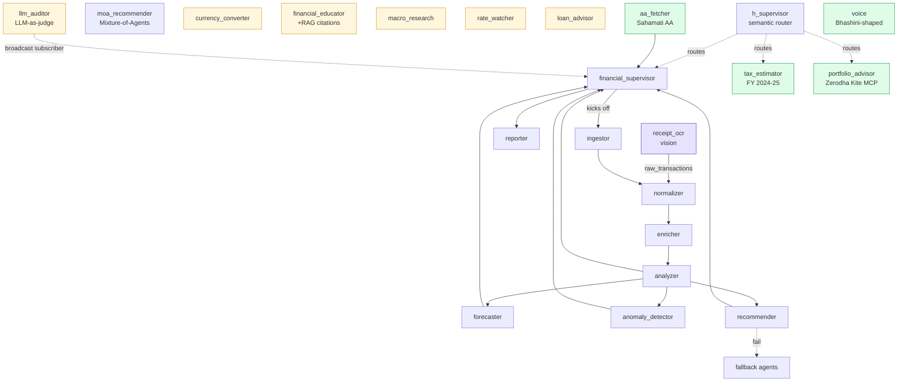

- **Grey** — canonical MARA pipeline.
- **Yellow** — ADK-inspired (educator, currency, macro, rates, loan, auditor).
- **Green** — India stack (portfolio, AA, voice, tax).
- **Purple** — vision (receipt OCR).

---

## Domain expansion: fraud, lending, tax, treasury, SME

Beyond the canonical MARA pipeline, Genie ships specialist agents across
every retail-and-institutional banking surface. Each is **deterministic-first**
so the routing logic is auditable from source code (RBI Rec 25 — explainability).
LLM rationale can be layered on top via `agents/reporter` when probabilistic
explanation is wanted.

### Fraud & financial crime (5)

| Agent | Purpose | Risk |
|---|---|---|
| `agents/fraud` | Velocity bursts, impossible-travel, after-hours large debits, high-risk merchant categories | Medium |
| `agents/mule` | Pass-through, fan-in/fan-out, post-credit burst — graph-pattern mule detection | High |
| `agents/aml_monitor` | FIU-IND STR generator: CTR (₹10L cash), LTR (₹50L wire), 7-day structuring, sanctions/PEP match | High |
| `agents/phishing_classifier` | URL + SMS + UPI VPA scorer: IP-literal, punycode, brand impersonation, OTP-share lures | Medium |
| `agents/synthetic_identity` | KYC anomaly stack: thin file, address velocity, PAN/Aadhaar name mismatch, PAN 5th-char check | High |

### Lending & credit (3)

| Agent | Purpose | Risk |
|---|---|---|
| `agents/cashflow_underwriter` | Alt-data credit score (300–900 CIBIL-comparable) from 6 explainable signals | High |
| `agents/debt_optimizer` | Month-by-month avalanche/snowball payoff simulator with time-to-freedom | Medium |
| `agents/prepayment_advisor` | Ranks loans by tax-adjusted effective APR; flags fixed-rate foreclosure penalty | Medium |

### Personal finance & behaviour (3)

| Agent | Purpose | Risk |
|---|---|---|
| `agents/subscription_detector` | Periodicity + amount-consistency finder; surfaces zombie subscriptions on price hikes | Low |
| `agents/goal_planner` | Monte-Carlo goal probability with p10/p50/p90 corpus envelope | Medium |
| `agents/emergency_fund` | Median-expense × 3/6/9-month coverage profile → gap + months-to-target | Low |

### Tax (3)

| Agent | Purpose | Risk |
|---|---|---|
| `agents/tax_harvester` | Indian STCL/LTCL harvester for FY 2024-25; ₹1.25L LTCG exemption, set-off rules | Medium |
| `agents/deductions_optimizer` | Old-regime Chapter VI-A ceiling fills (80C / 80CCD-1B / 80D / 80TTA) | Medium |
| `agents/advance_tax_planner` | Quarterly instalments per sec 211; sec 234B/234C shortfall warnings | Medium |

### Investments (4)

| Agent | Purpose | Risk |
|---|---|---|
| `agents/mf_screener` | Composite score (40 % CAGR, 25 % Sharpe, 20 % expense, 15 % consistency) | Medium |
| `agents/asset_allocator` | 100-age equity rule with risk/horizon adjustments + Buy/Sell rupee deltas | Medium |
| `agents/sip_vs_lumpsum` | Monte-Carlo comparator with regret probability | Medium |
| `agents/options_explainer` | Black-Scholes greeks (delta/gamma/theta/vega/rho) + 21-point payoff curve | Medium |
| `agents/dividend_planner` | DRIP simulator with net-of-tax projection + yield-on-cost | Low |

### SME banking (2)

| Agent | Purpose | Risk |
|---|---|---|
| `agents/working_capital` | DSO + DIO − DPO cycle; monthly forecast + runway months; TReDS hint when CCC >90d | Medium |
| `agents/invoice_discounter` | Greedy cheapest-effective-APR selector; rating premium AAA…BBB | Medium |

### Institutional risk / treasury (3)

| Agent | Purpose | Risk |
|---|---|---|
| `agents/var_calculator` | Historical + parametric VaR with Expected Shortfall (CVaR); √horizon scaling | High |
| `agents/lcr_projector` | Basel III LCR with RBI run-off factors; L2A 85 % / L2B 50 % haircuts; ≥100 % compliance flag | High |
| `agents/alm_agent` | 9-bucket asset-liability gap (1-7d through >5y); breach at ±15 %; NII shock under parallel rate move | High |

### Customer service & sustainability (2)

| Agent | Purpose | Risk |
|---|---|---|
| `agents/complaint_triage` | RBI Integrated Ombudsman Scheme 2021 classifier; drafts Annexure VI incident form | Medium |
| `agents/carbon_estimator` | Per-category kgCO₂e + MoM trend + top-3 reduction suggestions | Low |

All 26 agents above are documented in `agents/<name>/<name>.go` headers
with the rules, thresholds, and rate sources baked in. Each one has its own
`_test.go` (5–8 cases) — together they add **133 unit tests** that run
under the same `make test` / `go test ./agents/...` command as the rest.

---

## ADK-inspired extension agents

A second wave of specialists, ported and adapted from the
[Google ADK samples](https://github.com/google/adk-samples/tree/main/python/agents)
to fit Indian banking and FREE-AI. Full design rationale in
[`docs/adk-extension-proposal.md`](docs/adk-extension-proposal.md).

### KYC, claims & lending (4)

| Agent | Purpose | Risk |
|---|---|---|
| `agents/kyc_orchestrator` | Full RBI Master Direction KYC: PAN 5th-char + Aadhaar offline KYC + DigiLocker + PEP/sanctions → SDD/standard/EDD tier or auto-reject with Annexure VI | High |
| `agents/claim_adjudicator` | Bancassurance claims rule engine (waiting periods, exclusions, sub-limits, co-pay, sum-insured cap); HITL above ₹2L | High |
| `agents/sme_loan_workflow` | End-to-end SME lending DAG: GST → cashflow → CGTMSE → indicative offer → HITL → sanction letter (uses `pkg/workflow` Saga + HITL) | High |
| `agents/invoice_processor` | B2B invoice OCR + GSTIN structural validation + vendor master match + 3-way match (PO/GRN/invoice) | Medium |

### Research, batch & event-driven (3)

| Agent | Purpose | Risk |
|---|---|---|
| `agents/deep_research` | Multi-turn ReAct over RBI/Sahamati/FIU-IND corpora with cited brief; deterministic offline fallback for sandbox + CI | Medium |
| `agents/bulk_statement_analyzer` | N-statement consolidator with inter-account-transfer dedup for AA-driven onboarding | Medium |
| `agents/mpc_research` | RBI MPC event analyzer (repo Δ, stance shift, hawkishness, surprise vs consensus) with fan-out hints to `loan_advisor`, `prepayment_advisor`, `rate_watcher` | Low |

### Bancassurance & payments (4)

| Agent | Purpose | Risk |
|---|---|---|
| `agents/auto_insurance` | Motor FNOL with total-loss detection (≥75 % IDV), roadside dispatch, NCB-ladder renewal quote | Medium |
| `agents/health_preauth` | IRDAI cashless pre-auth: PPN gate, PED/specific waiting, room-rent proportionate deduction, procedure-package cap, HITL ≥₹5L | High |
| `agents/supply_chain_finance` | Buyer-concentration risk + TReDS auction candidate selection over receivables | Medium |
| `agents/payment_orchestrator` | UPI/IMPS/NEFT/RTGS routing with time-of-day RTGS-window awareness + HITL ≥₹50k | High |

### Cyber & signals (2)

| Agent | Purpose | Risk |
|---|---|---|
| `agents/cyber_guardian` | Session-level anomaly stack: impossible travel (Haversine), credential-stuffing density, unknown device, fingerprint churn | Medium |
| `agents/google_trends` | Surging/fading/steady search-interest classifier; fans out hints to `macro_research` and `mf_screener` | Low |

### Platform / infrastructure additions

| Package | Purpose |
|---|---|
| `pkg/policy/dsl` | Tiny CEL-style expression DSL for board policies — risk team can add rules without code releases (FREE-AI Rec 6) |
| `pkg/memory` LongTermMemory | Third memory tier — append-only consolidated facts per user with supersede semantics |
| `pkg/loader` XLSX + Scanned-PDF | Stdlib-only XLSX cell extractor + Tesseract OCR fallback for image-rich PDFs |
| `pkg/safety` Plugin chain | Named, stage-aware plugins + `HTTPShield` adapter template for Model Armor / Bedrock Guardrails / Lakera |
| `pkg/agent` SkillRegistry | Progressive-disclosure skill manifests to keep supervisor prompts compact |
| `pkg/observability/bq` | Warehouse-sink Event shape + JSONL sink + buffered async dispatcher for BigQuery / Snowflake |
| `agents/voice` `StreamingAgent` | Chunked streaming ASR/TTS (incremental partials, audio chunks) on a pluggable provider |

### Q1 hardening — security primitives

The four pieces shipped together as a defence-in-depth envelope. Each
has its own doc under `docs/packages/`; read all four to understand
how they layer.

| Package | Purpose |
|---|---|
| `pkg/storage/postgres` + `migrations/0005_rls.sql` | DB-enforced tenant isolation via Postgres Row-Level Security + `SET LOCAL` GUC (`WithTenant` / `WithAdminContext`). FREE-AI Rec 15. |
| `pkg/governance.TenantPolicy` | Bus-layer cross-tenant check that pairs with RLS — `expected_tenant` mismatch or missing `tenant_id` → deny before the agent runs |
| `pkg/auth/tokenexchange` | OAuth 2.0 Token Exchange (RFC 8693). Dual-identity tokens (`Subject = user`, `Actor = agent`), N-hop nested actor chains. FREE-AI Rec 22. |
| `pkg/agent.Tier` | Sketch / Prototype / Beta / Production promotion model. Dispatch gate refuses customer-facing traffic to anything below Production. Default-to-Prototype (fail closed). FREE-AI Rec 17. |

End-to-end integration test that composes all four:
`tests/security_envelope_test.go`.

All extension agents follow the same contract as the originals — typed
JSON payloads, declared `RiskLevel()`, structured `Disclaimer` field,
Annexure VI `IncidentPayload` on hard rejects, full `HandleMessage`
dispatch test. The cluster adds roughly **135 unit tests** and lifts the
total package count past **100 green**.

---

## End-to-end finance flow

What happens when a user uploads a CSV and asks *"Where am I overspending?"*:

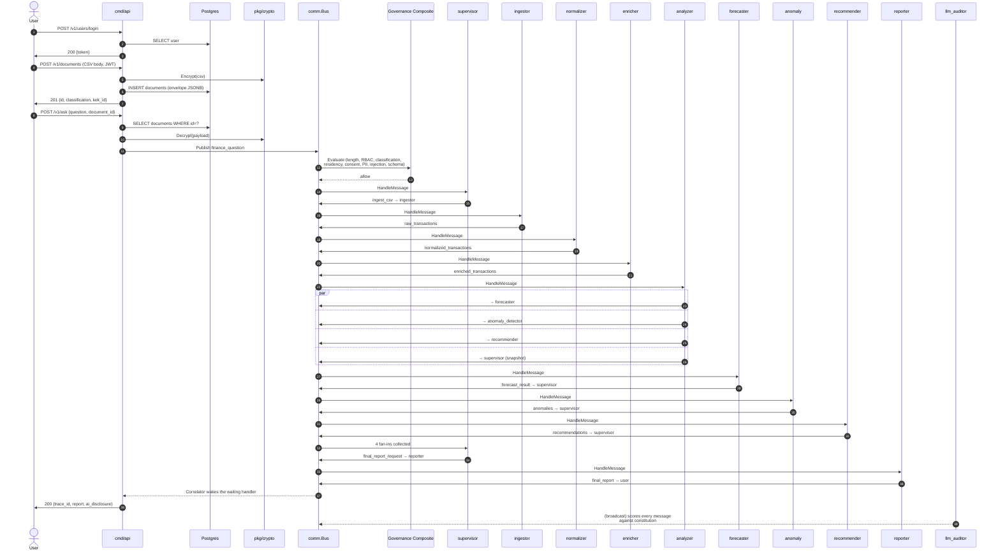

Trace context propagates across goroutines via `Message.Metadata` — the W3C
`traceparent` header is injected on publish and re-extracted by the
orchestrator before each agent runs, so the entire flow appears as one
distributed trace in Tempo.

---

## Repository layout

```
genie/
├── cmd/
│   ├── api/           # HTTP service-edge binary (auth + RBAC + Postgres + OTLP + Ollama factory)
│   ├── genie/         # CLI that runs the bus pipeline end-to-end in-process
│   ├── demo/          # toy planner/executor/coordinator demo
│   ├── red-team/      # adversarial probe corpus runner
│   └── scaffold/      # generates a new agent skeleton
├── agents/            # 60+ specialist + fallback + hierarchical + MoA + vision + ADK-inspired
├── pkg/
│   ├── protocol/      # Message + Classification + metadata keys
│   ├── agent/         # Agent + Environment + RiskClass
│   ├── registry/      # in-memory registry
│   ├── comm/          # in-memory pub/sub bus (with OTel spans)
│   ├── orchestration/ # orchestrator (governance + tracing + fallback)
│   ├── governance/    # composite policy
│   ├── memory/        # KV + SemanticMemory + EpisodicMemory + LongTermMemory + Summariser
│   ├── observability/ # slog + OTel + OpenInference semconv
│   │   └── bq/        # BigQuery / Snowflake JSONL sink + async buffer
│   ├── eval/          # records + ragas/ + checklist/ + drift/ + hallucination/ + elo/
│   ├── auth/          # JWT + bcrypt + oauth_device/ + oauth2/ + webauthn/
│   ├── crypto/        # envelope AES-GCM + EnvKeyResolver + KMSKeyResolver
│   ├── storage/postgres/ # pgxpool + embedded migrations + repos
│   ├── busio/         # Correlator + EventTap (SSE/WS)
│   ├── web/           # chi router + middleware + handlers + pprof
│   ├── mcp/           # MCP client + server
│   ├── a2a/           # A2A client + server
│   ├── cloudevents/   # CloudEvents 1.0 envelope
│   ├── policy/        # board-approved AI policy YAML loader
│   │   └── dsl/       # tiny CEL-style expression DSL for policy rules
│   ├── incidents/     # Annexure VI form + auto-record
│   ├── compliance/    # consent ledger + hash-chained audit log
│   ├── sovereignty/   # region tags + provider registry
│   ├── llm/           # Provider + 5 impls + wrappers
│   ├── rag/           # vector + BM25 + RRF + rerank + HyDE + Self-RAG + CRAG
│   │   └── pgvector/  # pgvector-backed VectorStore
│   ├── graphrag/      # entity graph + traversal
│   ├── reasoning/     # CoT + ReAct + Reflexion + CoV + Step-Back + Semantic Router
│   ├── prompt/        # versioned registry + few-shot + Thompson bandit
│   ├── constitution/  # 7-Sutra system prompt + Critique
│   ├── schema/        # JSON-Schema validator + SchemaPolicy
│   ├── safety/        # jailbreak + topic + toxicity + bias + pluggable plugin chain
│   ├── synth/         # synth data generator + RLAIF feedback store
│   ├── dpo/           # export feedback to DPO/RLAIF JSONL pairs
│   ├── loader/        # PDF/HTML/DOCX/XLSX + scanned-PDF OCR + entity extraction
│   ├── toolkit/       # 7-Sutra compliance Scorecard
│   ├── workflow/      # DAG + Saga + HITL + event-sourced sink
│   ├── privacy/       # HMAC tokenisation + DP noise
│   ├── identity/      # did:key + W3C Verifiable Credentials
│   ├── aibom/         # Manifest + CycloneDX 1.6 + Ed25519 signing
│   └── federated/     # FedAvg + additive secret-sharing
├── config/
│   ├── ai-policy.example.yaml      # Annexure V board policy
│   └── constitution.yaml            # 7 Sutras
├── data/sample.csv
├── deploy/local/      # tempo + otel-collector + grafana configs
├── docs/
│   ├── openapi.yaml   # full HTTP spec
│   └── asyncapi.yaml  # bus event spec
├── tests/             # end-to-end integration test
├── Dockerfile
├── docker-compose.yaml # postgres + tempo + grafana + otel-collector + ollama + genie-api
├── Makefile
└── .circleci/config.yml
```

**Module path:** `github.com/PratikDhanave/multi-agent-reference-architecture-go`

---

## Quick start (CLI demo)

Zero external dependencies. Runs the full bus pipeline in-process with
stdout OTel exporters.

```bash
git clone https://github.com/c2siorg/genie.git
cd genie
go test ./...                       # 100+ packages all green
go run ./cmd/genie                  # full pipeline → console
```

Expected output (final lines):

```text
[supervisor] all fan-outs received for trace=tr-...; dispatching reporter
[reporter] final report ready (1093 bytes)

=== FINAL REPORT ===
Genie Financial Report
Question: Where am I overspending vs last month?
Currency: INR
Income:  10000000 (minor units)
Expense: 3279800 (minor units)
Net:     6720200 (minor units)
Top categories: housing:rent, food:delivery, Utilities
Forecast: {...}
Anomalies: {...}
Recommendations: {...}
```

A `genie-traces.json` file is produced alongside the binary — a stream of
OTel spans mirroring the sequence diagram above.

---

## Run the full stack via docker-compose

```bash
make compose-up
```

Brings up:

| Service | URL | Purpose |
| --- | --- | --- |
| `genie-api` | <http://localhost:8080> | the service |
| `postgres` | localhost:5432 | persistence (genie/genie/genie) |
| `ollama` | localhost:11434 | on-prem LLM runtime |
| `ollama-pull` | (one-shot) | warms `llama3.2:1b` + `nomic-embed-text` |
| `otel-collector` | grpc :4317 | OTLP receiver |
| `tempo` | <http://localhost:3200> | trace backend |
| `grafana` | <http://localhost:3000> | UI (anonymous admin) |

In Grafana, open **Explore → Tempo** and search by service name
`genie-api`. Each `/v1/ask` request appears as one distributed trace
spanning the HTTP server, the bus, governance, and every agent that
handled a message — plus LLM spans tagged with OpenInference semantic
conventions.

Stop everything with `make compose-down`.

---

## HTTP API: signup → upload → ask

```bash
# 1) Sign up
TOKEN=$(curl -s -X POST localhost:8080/v1/users \
  -H 'Content-Type: application/json' \
  -d '{"email":"alice@example.com","name":"Alice","password":"hunter2hunter2"}' \
  | jq -r .token)

# 2) Upload an encrypted CSV
DOC_ID=$(curl -s -X POST 'localhost:8080/v1/documents?description=Jan%20statement&classification=pii' \
  -H "Authorization: Bearer $TOKEN" \
  --data-binary @data/sample.csv \
  | jq -r .id)

# 3) Ask Genie (synchronous)
curl -s -X POST localhost:8080/v1/ask \
  -H "Authorization: Bearer $TOKEN" \
  -H 'Content-Type: application/json' \
  -d "{\"question\":\"Where am I overspending?\",\"document_id\":\"$DOC_ID\"}" | jq .

# 3b) Ask Genie (Server-Sent Events stream)
curl -N -X POST localhost:8080/v1/ask/stream \
  -H "Authorization: Bearer $TOKEN" \
  -H 'Content-Type: application/json' \
  -d "{\"question\":\"Where am I overspending?\",\"document_id\":\"$DOC_ID\"}"
# event: ai_disclosure
# data: This response was produced by an AI pipeline...
#
# event: trace
# data: tr-1779514412090640000
#
# event: agent.handle
# data: {"from":"ingestor","to":"normalizer","type":"raw_transactions",...}
# ...
# event: report
# data: Genie Financial Report ...

# 3c) Bidirectional chat (WebSocket)
wscat -c "ws://localhost:8080/v1/chat/ws" \
      -H "Authorization: Bearer $TOKEN"
> {"question":"What's my biggest expense?","document_id":"<id>"}
```

Full spec: [`docs/openapi.yaml`](docs/openapi.yaml).
Bus event catalogue: [`docs/asyncapi.yaml`](docs/asyncapi.yaml).

---

## Authentication & Authorization

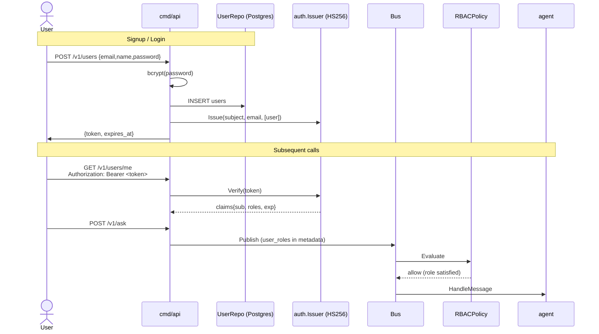

- **JWT** — HS256 signed by `GENIE_JWT_SECRET`. 60-minute TTL. Implemented in
  stdlib (`pkg/auth/jwt.go`) so the security surface stays small.
- **Passwords** — bcrypt via `golang.org/x/crypto/bcrypt`.
- **Roles** — `user` (default), `advisor`, `admin`. Stored as a Postgres
  `TEXT[]` on `users`.
- **Two-layer authz**:
  - `pkg/web/mid.Auth` verifies the JWT, pins `auth.Claims` onto the request.
  - `pkg/web/mid.RequireRole(roles...)` is an optional route-level gate.
  - `pkg/governance.RBACPolicy` runs on the **bus** before any agent runs —
    so even a compromised handler can't sneak data past authz.

---

## Document encryption

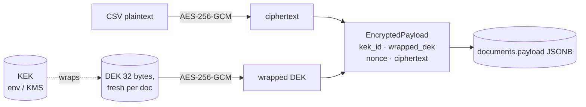

- Each upload gets a fresh **data encryption key (DEK)**, wrapped by the
  active **key encryption key (KEK)**.
- **Local** — `pkg/crypto.EnvKeyResolver` reads the KEK from
  `GENIE_KEK_BASE64` (32 bytes, base64-encoded). Generate with
  `openssl rand -base64 32`.
- **Production** — `pkg/crypto.KMSKeyResolver` is the production shape.
  Plug AWS KMS / GCP KMS / HashiCorp Vault Transit by implementing the
  `KMSClient` interface. Genie never sees the raw KEK in the prod path.
- **Storage** — `EncryptedPayload` is stored in `documents.payload` as
  JSONB. Decryption only happens in `/v1/ask`, in memory, and the
  plaintext crosses the bus marked `classification=pii`.
- **Retention** — `expires_at` columns + `db.StartRetentionJob` purge
  expired rows every 6h (RBI Rec 15).
- **Key rotation** — schema accommodates it (`kek_id` per row); rotation
  logic is on the roadmap.

---

## Governance & policies

Every message that crosses the bus is evaluated by a composite policy
**before** the destination agent's `HandleMessage` runs.

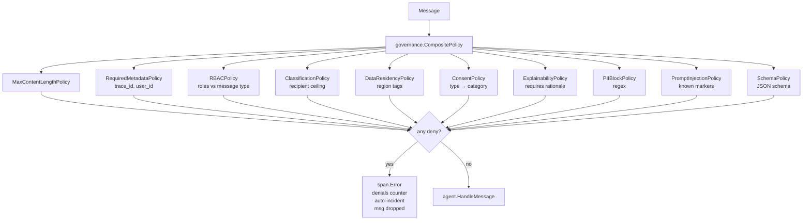

The stack is loaded from a **board-approved YAML**
([`config/ai-policy.example.yaml`](config/ai-policy.example.yaml)):

```yaml
version: "0.1.0"
board_approved_on: "2025-08-13"
owner: "Chief Risk Officer"
principles: ["Trust is the Foundation", "People First", ...]

governance:
  admin_bypass: true
  rbac:
    finance_question:  ["user", "advisor", "admin"]
    portfolio_request: ["user", "advisor", "admin"]

risk:
  max_content_length_bytes: 262144

data:
  retention_days: 180
  block_pii: true
  block_prompt_injection: true

consumer:
  ai_disclosure_banner: |
    This response was produced by an AI pipeline at Genie...

sovereignty:
  home_region: "in"
  allow_cross_border_for_public: true

consent:
  type_to_category:
    portfolio_request: "portfolio"

explainability:
  applies_to: ["recommendations"]
```

The board owns the values. Engineers ship the loader (`pkg/policy`) and the
individual policies (`pkg/governance`).

Run the adversarial probe corpus against the active policy:

```bash
make red-team
# OK: all probes denied / allowed as expected.
```

---

## Observability: traces, metrics, logs

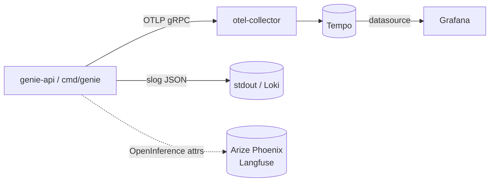

- **Traces** — spans around `http <method> <path>`, `governance.evaluate`,
  `bus.publish`, `agent.handle`, `llm.complete`. Trace context propagates
  through `Message.Metadata` so async hops stay linked.
- **Metrics**:
  - `genie.bus.messages_published`
  - `genie.agent.messages_handled`
  - `genie.governance.denials`
  - `genie.agent.errors`
  - `genie.agent.handle_duration_ms` (histogram)
  - `genie.llm.tokens` · `cost_micros` · `latency_ms`
- **Logs** — structured slog (`pkg/observability.SlogLogger`).
- **OpenInference** — LLM spans carry `llm.provider`, `llm.model_name`,
  `llm.token_count.prompt` etc. — picked up unchanged by Arize Phoenix,
  Langfuse, and other LLM-aware observability platforms.

---

## LLM providers

`pkg/llm.Provider` is the abstract surface. Five implementations ship.

| Provider | Where | Region | Use |
| --- | --- | --- | --- |
| **Mock** | `pkg/llm/llm.go` | `on-prem` | Tests, CI, CLI demo |
| **Ollama** | `pkg/llm/ollama.go` | `on-prem` | Local dev, PII residency |
| **Anthropic** | `pkg/llm/anthropic.go` | `us` | Production reasoning |
| **OpenAI** | `pkg/llm/openai.go` | `us` | Production / Azure OpenAI |
| **Gemini** | `pkg/llm/gemini.go` | `us` | Google / Vertex AI |

Each provider respects the residency envelope — if the request says
`Residency{Region:"in", AllowCrossBorder:false}` and the provider's region
is `us`, it returns `ErrResidencyDenied` without making the network call.

Production wrapper chain (configured in [`cmd/api/llmstack.go`](cmd/api/llmstack.go)):

```
Provider → CostObserver → CachedProvider → BudgetedProvider
        → DeadlineProvider → CircuitProvider
```

| Wrapper | Behaviour |
| --- | --- |
| `CostObserver` | OTel spans + metrics for tokens/latency/cost |
| `CachedProvider` | Exact-match cache keyed by SHA-256(model+messages+temp) |
| `BudgetedProvider` | Daily per-principal token cap; `ErrBudgetExceeded` |
| `DeadlineProvider` | Per-call timeout |
| `CircuitProvider` | Closed/Open/HalfOpen breaker after N consecutive errors |
| `ShadowProvider` | Fires Secondary in background; collects results for offline compare |
| `ChainProvider` | Try Primary; fall back to Secondary on error |

```bash
# Switch the API to a real LLM via env:
export GENIE_LLM=ollama
make compose-up
# Or for hosted:
export ANTHROPIC_API_KEY=sk-ant-...   # plug via cmd/api/llmstack.go
```

---

## Vision adapter + receipt OCR

`pkg/llm.VisionProvider` is the optional capability marker. `OllamaProvider`
implements it. `agents/receipt_ocr` reads a photographed receipt and emits a
canonical `finance.Transaction` ready for the normalizer.

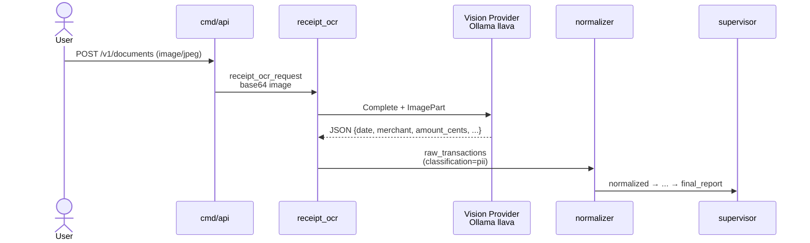

```bash
# After pulling a vision-capable model:
ollama pull llava

# Then upload + ask:
curl -X POST localhost:8080/v1/documents -H "Authorization: Bearer $TOKEN" \
     --data-binary @receipt.jpg -H 'Content-Type: image/jpeg'
curl -X POST localhost:8080/v1/ask \
  -H "Authorization: Bearer $TOKEN" \
  -d '{"question":"Categorise the attached receipt","document_id":"<image-doc-id>"}'
```

---

## Retrieval: hybrid RAG + GraphRAG + pgvector

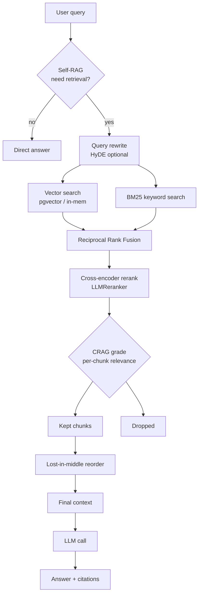

**Retrieval primitives** (`pkg/rag`):

- `HashEmbedder` (deterministic, dependency-free) + `OllamaEmbedder`
  (real embeddings via `/api/embeddings`).
- `MemoryStore` (in-process cosine) + `pgvector.Store` (pgvector with
  `vector_cosine_ops`, namespace isolation).
- `BM25Store` (k1=1.5, b=0.75) + `HybridSearch(vec, bm, q, topK)` with
  Reciprocal Rank Fusion (k=60).
- `LLMReranker` — cross-encoder-shaped reranking via one LLM call.
- `HyDE` + `LLMQueryRewriter` — boost recall on terse queries.
- `SelfRAG.Should(q)` — model decides whether to retrieve.
- `CRAG.Grade(q, chunks)` — drop low-relevance chunks, returns confidence.
- `LostInMiddleReorder(chunks)` — head/tail-biased ordering.
- `SplitParentChild(text, parent, child)` — precision-vs-context split.
- `TimeDecay(chunks, λ, ageOf)` — recency bias for transactions.

**Entity graph** (`pkg/graphrag`):

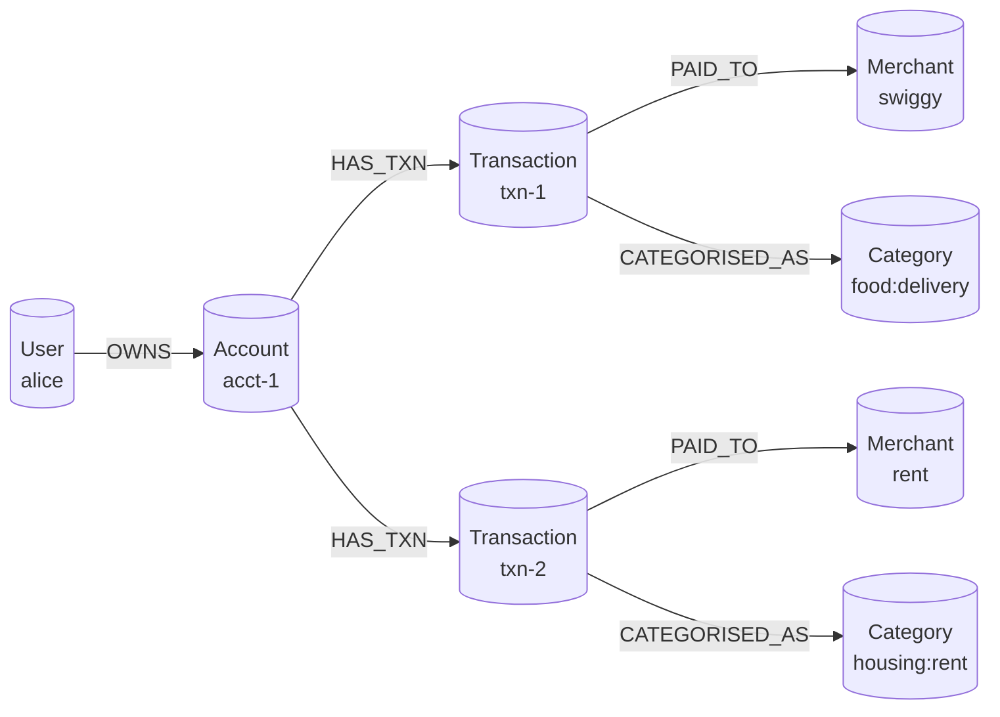

`Graph.IngestTransactions(userID, txns)` builds this automatically from
canonical `finance.Transaction` records. `Graph.Neighborhood(seed, hops)`
walks k hops bidirectionally. The recommender uses
`ExplainSpending(userID, 3)` to ground recommendations in specific paths
— citation-style explainability instead of vector vibes.

---

## Reasoning patterns

| Pattern | Where | Use case |
| --- | --- | --- |
| **Chain-of-Thought** | `reasoning.CoTPrompt`, `SplitCoT` | Force step-by-step thinking |
| **ReAct** | `reasoning.ReAct(...)` | Interleave reasoning with MCP tool calls |
| **Reflexion** | `reasoning.Reflexion(...)` | Initial → Critique → Refined with self-memory |
| **Chain-of-Verification** | `reasoning.CoV(...)` | Initial → verifying questions → answer each → consolidate |
| **Step-Back** | `reasoning.StepBack(...)` | Abstract the question before answering |
| **Self-consistency / MoA** | `agents/moa_recommender` | N panellists vote |
| **Semantic Router** | `reasoning.SemanticRouter` | Classify a query to the right specialist via embedding similarity |

```go
// ReAct loop with one tool.
result, _ := reasoning.ReAct(ctx, provider, "model", "rate finder", "rate?",
    []reasoning.Tool{{
        Name: "rate",
        Run:  func(_ context.Context, _ string) (string, error) { return "83.0", nil },
    }}, 3)

// Reflexion with persistent self-memory.
trace, _ := reasoning.Reflexion(ctx, provider, "model", system, user, memory.Recent)

// Chain-of-Verification — three-call hallucination cutter.
res, _ := reasoning.CoV(ctx, provider, "model", system, user)
// res.Final has been corrected by the verifications.
```

---

## Memory: semantic + episodic + summarisation

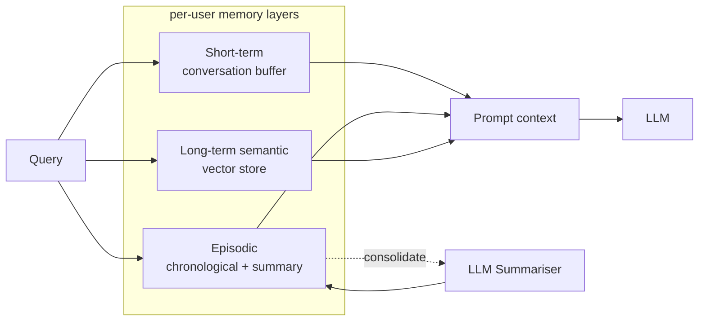

- `pkg/memory.SemanticMemory` — per-user `rag.MemoryStore`; strict user
  isolation; embed-and-search via the configured embedder.
- `pkg/memory.EpisodicMemory` — rolling buffer of `Episode{Role, Content,
  OccurredAt}`. When the buffer exceeds threshold, the oldest half is
  consolidated into a summary via the configured `Summariser`.

---

## Evaluation

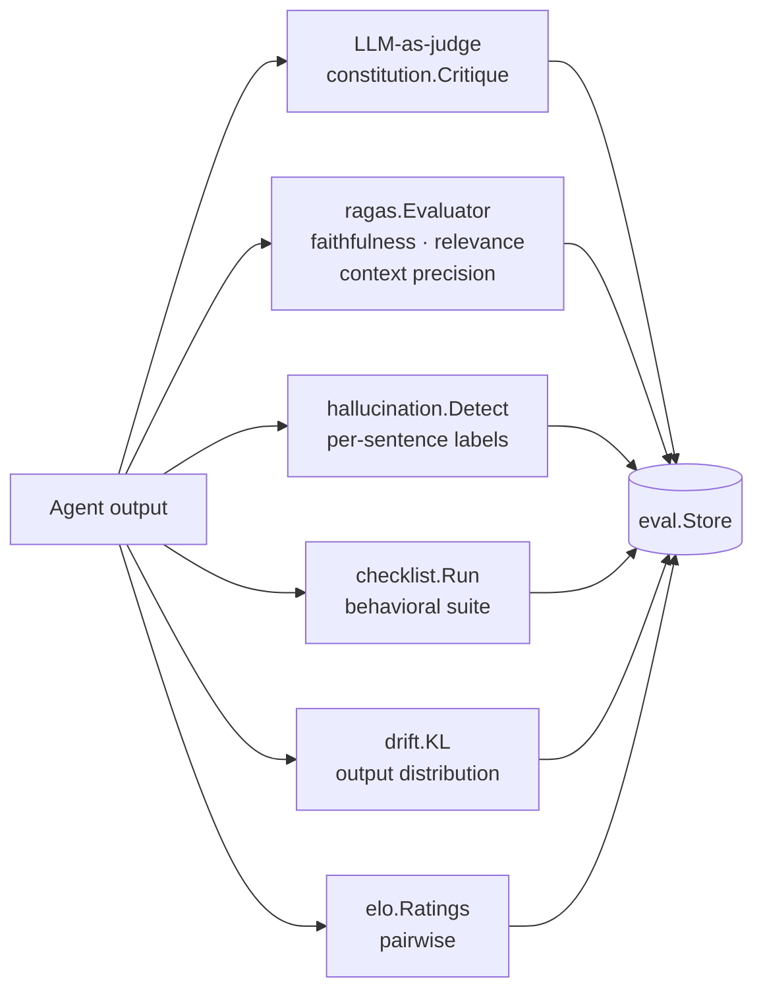

| Package | Measures |
| --- | --- |
| `pkg/eval/ragas` | Faithfulness / answer-relevance / context-precision via LLM |
| `pkg/eval/checklist` | Canonical input → expected substring / no errors |
| `pkg/eval/drift` | KL divergence between baseline and recent distribution |
| `pkg/eval/hallucination` | Per-sentence supported/unsupported/contradicted |
| `pkg/eval/elo` | Pairwise comparison + ranking of prompt or model versions |
| `pkg/toolkit` | 7-Sutra Scorecard — one default check per Sutra |

---

## Safety

| Check | Where | Mode |
| --- | --- | --- |
| Jailbreak detection | `safety.HeuristicJailbreak` + `safety.LLMJailbreak` | Heuristic first, LLM if heuristic passes |
| Prompt-injection patterns | `governance.PromptInjectionPolicy` | Regex on inbound message content |
| PII block / redact | `governance.PIIBlockPolicy` | Card numbers, emails, phone numbers |
| Topic guardrail | `safety.TopicGuardrail` | Allowlist of terms |
| Toxicity heuristic | `safety.ToxicityHeuristic` | Banned-term match |
| Bias scorer | `safety.ComputeDemographicParity` | Group-rate gap |
| Output schema | `governance.SchemaPolicy` | JSON Schema validation |
| Explainability | `governance.ExplainabilityPolicy` | Requires `rationale` on recommender output |
| Red teaming | `cmd/red-team` | Probe corpus vs composite policy |

---

## Workflow: DAG + Saga + HITL

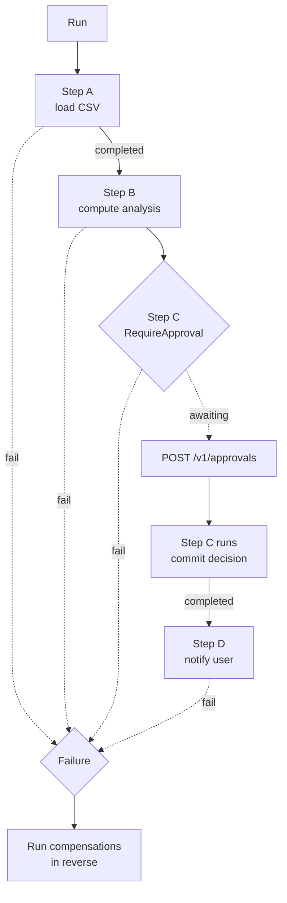

`pkg/workflow.Workflow`:

- Topological execution with cycle detection.
- `Step.Compensate` runs in reverse for already-completed steps on failure.
- `Step.RequireApproval` pauses until `ApproveStep(id)` is called.
- Event-sourced `Sink` records every transition (`started`, `completed`,
  `failed`, `awaiting_approval`, `approved`, `compensated`).

```go
w := workflow.New(workflow.NewInMemorySink())
w.Add(workflow.Step{ID: "load", Run: load})
w.Add(workflow.Step{ID: "analyse", DependsOn: []string{"load"}, Run: analyse,
    Compensate: rollbackAnalysis})
w.Add(workflow.Step{ID: "commit", DependsOn: []string{"analyse"},
    RequireApproval: true, Run: commit})
_ = w.Run(ctx, workflow.State{})
```

---

## MCP integration (Zerodha Kite)

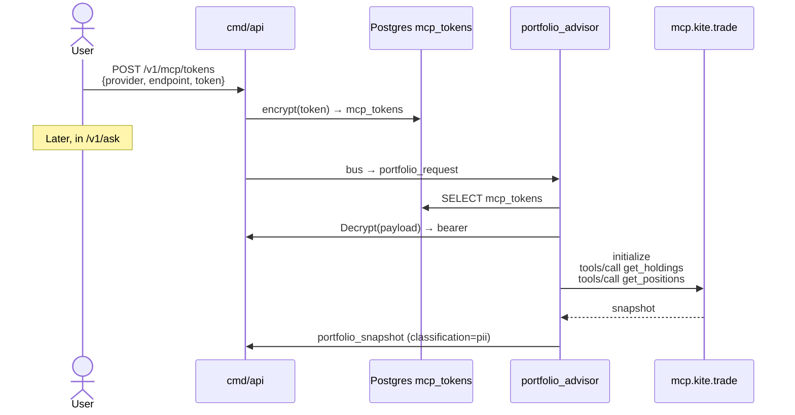

- `pkg/mcp/client` — JSON-RPC over streamable HTTP. Compatible with the
  Zerodha hosted server at `https://mcp.kite.trade/mcp`.
- `pkg/mcp/server` — Genie exposes its own read-only agents
  (`financial_educator`, `macro_research`, `rate_watcher`) as MCP tools at
  `/mcp` so Claude Desktop / Cursor can drive Genie.

---

## Agent-to-Agent (A2A) protocol

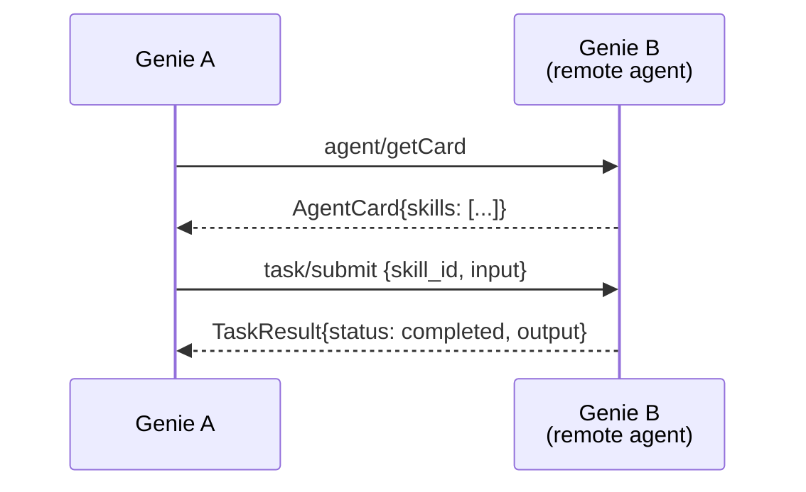

`pkg/a2a` lets one Genie instance call another (or any A2A-compliant peer)
as a first-class peer agent. Symmetric to `pkg/mcp` but at the agent
granularity instead of per-tool.

```go
client := a2a.NewClient("https://peer-genie.example/a2a")
card, _ := client.GetAgentCard(ctx)
result, _ := client.SubmitTask(ctx, a2a.Task{
    SkillID: "explain_finance",
    Input:   map[string]any{"query": "what is a SIP?"},
})
```

---

## OAuth device flow for MCP onboarding

Replaces the manual paste of Zerodha session tokens with the standard
RFC 8628 device authorisation grant.

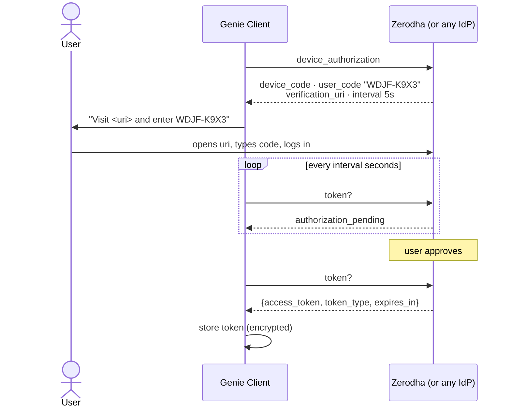

User codes use a Crockford-style base32 (`WDJF-K9X3`) to avoid 0/1/8/O
confusion.

---

## OAuth 2.1 + WebAuthn passwordless login

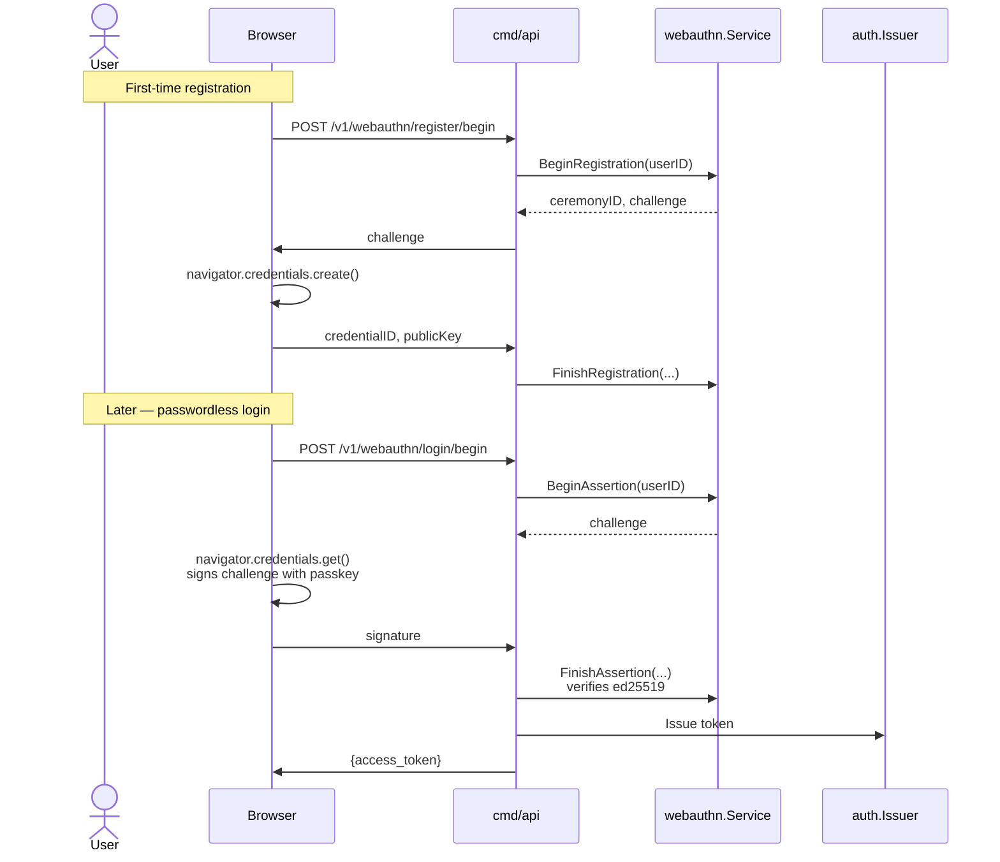

OAuth 2.1 PKCE for delegated clients (`pkg/auth/oauth2`):

```go
verifier, challenge, _ := oauth2.GenerateVerifier()
authResp, _ := server.Authorize(oauth2.AuthorizeRequest{
    ClientID:            "my-app",
    CodeChallenge:       challenge,
    CodeChallengeMethod: oauth2.MethodS256, // OAuth 2.1 rejects "plain"
}, subject, email, roles)
tok, _ := server.Token(oauth2.TokenRequest{
    Code: authResp.Code, CodeVerifier: verifier, ClientID: "my-app",
})
```

---

## Sovereign AI: data residency + on-prem inference

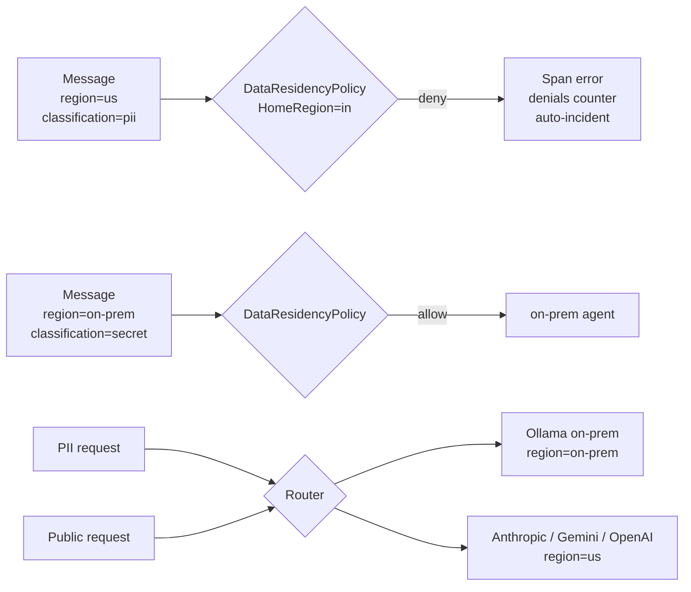

- `pkg/sovereignty.ProviderRegistry` — allowlist of external providers
  and what classifications each may receive.
- `governance.DataResidencyPolicy` — denies PII/Secret leaving `HomeRegion`
  unless going on-prem.
- `OllamaProvider.Region() = "on-prem"` — automatically passes residency
  checks for any home region.

---

## RBI FREE-AI alignment

The August 2025 [RBI FREE-AI report](https://rbidocs.rbi.org.in/rdocs/PublicationReport/Pdfs/FREEAIR130820250A24FF2D4578453F824C72ED9F5D5851.PDF)
defines 7 Sutras + 26 Recommendations across 6 Pillars. Genie's
implementation status:

| Rec | Title | Genie |
| --- | --- | --- |
| 2 | AI Innovation Sandbox | ✅ `cmd/genie` |
| 4 | Indigenous AI Models | ✅ `pkg/llm.OllamaProvider` |
| 6 | Adaptive Policies | ✅ `pkg/policy` YAML + `pkg/policy/dsl` CEL-style expressions |
| 8 | Graded Liability | ✅ `pkg/incidents.Grade` |
| 14 | Board-Approved AI Policy | ✅ `config/ai-policy.example.yaml` (Annexure V) |
| 15 | Data Lifecycle Governance | ✅ envelope encryption + retention |
| 16 | AI System Governance + Autonomous | ✅ `RiskLevel()` + supervisor + per-agent deadline/circuit/budget |
| 17 | Product Approval | 🟡 inventory + risk class |
| 18 | Consumer Protection | ✅ AI disclosure banner on every Verdict/Decision |
| 19 | Cybersecurity | ✅ JWT + RBAC + classification + injection + rate-limit + `agents/cyber_guardian` session checks |
| 20 | Red Teaming | ✅ `cmd/red-team` |
| 21 | BCP for AI | ✅ `agents/fallback` + `Orchestrator.SetFallback` |
| 22 | AI Incident Reporting (Annexure VI) | ✅ `pkg/incidents` + auto-record + `IncidentPayload` on KYC/payment rejects |
| 23 | AI Inventory | ✅ `GET /v1/ai-inventory` — live, built from registry (60+ agents) |
| 24 | AI Audit Framework | 🟡 `agents/auditor` + `pkg/observability/bq` warehouse sink for long-horizon analytics |
| 25 | Disclosures | ✅ `GET /v1/disclosures` |
| 26 | AI Toolkit | ✅ `pkg/toolkit` 7-Sutra Scorecard + `pkg/safety` plugin chain |

Items 1, 3, 5, 7, 9–13 are regulator / SRO actions (outside Genie's scope).

```bash
# RBI-aligned tooling
make red-team                              # adversarial probes
curl localhost:8080/v1/disclosures | jq .  # public governance disclosure
curl -H "Authorization: Bearer $ADMIN" localhost:8080/v1/ai-inventory | jq .
curl -H "Authorization: Bearer $ADMIN" localhost:8080/v1/aibom | jq .
```

---

## Federated learning + secure aggregation

Aligned with **RBI Rec 4** — indigenous sector models trained without
moving raw data across institutions.

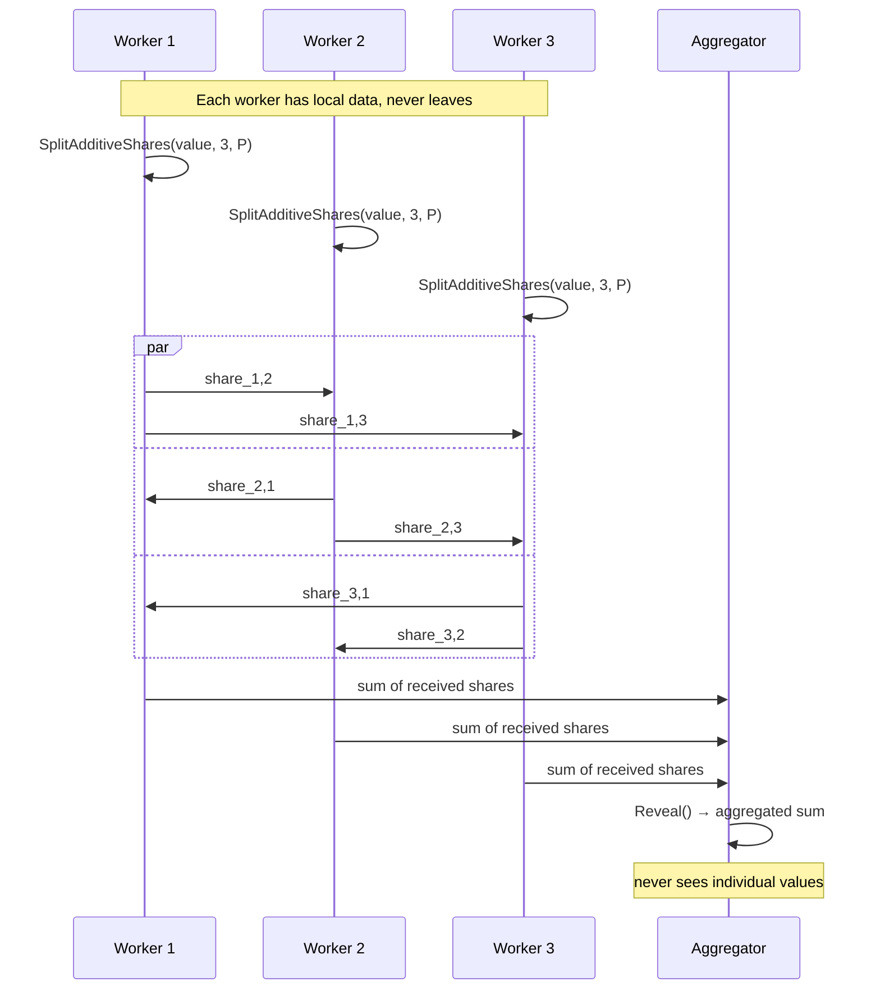

```go
// FedAvg over Worker updates (sample-count-weighted).
avg, _ := federated.FedAvg([]federated.Update{
    {WorkerID: "bank-a", Samples: 100, Weights: federated.Weights{0.1, 0.2}},
    {WorkerID: "bank-b", Samples: 300, Weights: federated.Weights{0.3, 0.4}},
})

// Secure aggregation primitive.
shares, _ := federated.SplitAdditiveShares(big.NewInt(42), 3, modulus)
```

---

## AIBOM + CycloneDX + Sigstore signing

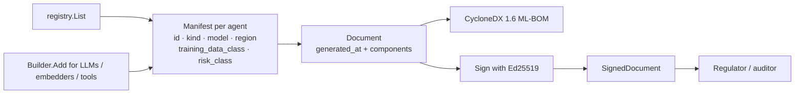

```go
signer, _ := aibom.NewEd25519Signer()
sd, _ := aibom.Sign(doc, signer)
_ = aibom.Verify(sd) // nil on success; non-nil if tampered

// Canonical CycloneDX 1.6 ML-BOM:
cdx := doc.ToCycloneDX()
```

---

## Identity: DIDs + Verifiable Credentials

`pkg/identity` ships minimum-viable **did:key** (Ed25519) +
**W3C Verifiable Credentials 1.1** with `Ed25519Signature2020` proofs:

```go
issuer, _ := identity.NewDIDKey()   // did:key:z...
vc := &identity.VerifiableCredential{
    Type: []string{"VerifiableCredential", "GenieAgentManifest"},
    CredentialSubject: map[string]any{
        "agentId":   "ingestor",
        "riskClass": "low",
        "auditedOn": "2026-05-23",
    },
}
identity.IssueVC(issuer, vc)
identity.VerifyVC(vc, issuer.Public) // nil if signature ok
```

Pairs with the AIBOM — each agent's manifest can be packaged as a VC and
shared with regulators.

---

## CloudEvents + AsyncAPI + OpenInference

```mermaid
flowchart LR
    BUS[protocol.Message] --Wrap--> CE[CloudEvents 1.0<br/>specversion · id · source<br/>type=com.c2siorg.genie.*<br/>genieclassification · genietraceid]
    CE --> EXT[Kafka / NATS / Knative consumers]
    BUS -.described by.-> ASYNC[docs/asyncapi.yaml]
    SPAN[OTel LLM span] -.semconv.-> OINF[OpenInference / OpenLLMetry<br/>Arize Phoenix · Langfuse]
```

```go
ev := cloudevents.Wrap(msg, "genie://bus")
// ev marshals to CloudEvents 1.0 structured-mode JSON.

got, _ := cloudevents.Unwrap(ev)
// got.To, got.Type, got.Metadata are restored.
```

---

## Web UI

Genie ships a single-page UI embedded into the binary — no Node, no build
step. After `make compose-up`, open <http://localhost:8080/> and you get
redirected to `/ui/`.

```mermaid
flowchart LR
    BR[Browser] --> ROOT[GET /]
    ROOT -- 302 --> UI[/ui/]
    UI --> APP[index.html + styles.css + app.js]
    APP -->|fetch /v1/*| API[Genie HTTP API]
    APP -->|fetch + ReadableStream| SSE[/v1/ask/stream/]
    APP -. shows .-> EVT[Agent pipeline events]
    APP -. shows .-> REPORT[Final report]
```

What the UI covers:

- **Auth** — sign up + sign in flow; JWT stored in localStorage; logout.
- **Ask** — pick a document, type a question, submit either synchronously
  (`POST /v1/ask`) or streamed (`POST /v1/ask/stream`). Pipeline events
  stream into a live event log; the final report renders below.
- **Documents** — upload a CSV (encrypted server-side via envelope
  AES-256-GCM before reaching Postgres); pick classification + description.
- **Governance** — public `/v1/disclosures`; admin-only `/v1/ai-inventory`,
  `/v1/aibom`, `/v1/incidents`.
- **Settings** — point the UI at a different Genie instance; live
  readiness check via `/readyz`.

Plain HTML/CSS/JS — no framework, automatic light/dark mode via
`prefers-color-scheme`:

- [`pkg/web/handlers/ui/index.html`](pkg/web/handlers/ui/index.html)
- [`pkg/web/handlers/ui/styles.css`](pkg/web/handlers/ui/styles.css)
- [`pkg/web/handlers/ui/app.js`](pkg/web/handlers/ui/app.js)

Served by `handlers.NewUI()` which uses `embed.FS` so the assets ship
inside `genie-api`. To customise without rebuilding the binary, swap
`embed.FS` for a filesystem-backed `fs.FS` and point it at a local
directory during dev.

---

## Live profiling (pprof)

Standard-library pprof under `/debug/pprof/*`, behind JWT auth + the
`admin` role:

```bash
go tool pprof "localhost:8080/debug/pprof/heap?seconds=30" \
  -header "Authorization=Bearer $ADMIN_TOKEN"
```

For tokenless local debugging, call `web.StartLocalPprof("127.0.0.1:6060")`
from `cmd/api`. Bound to localhost only — never exposed externally.

---

## Scaffolding a new agent

```bash
make scaffold name=tax_estimator_v2 cap=estimate_tax_v2 \
  in=analysis_result out=tax_estimate_v2 next=financial_supervisor
```

Generates:

```
agents/tax_estimator_v2/
  tax_estimator_v2.go      # full Agent skeleton with TODO
  tax_estimator_v2_test.go # passing pass-through test
```

Prints the registration snippet for `cmd/api/main.go`:

```go
register(tax_estimator_v2.New())
```

---

## Testing & quality gates

```bash
make test                  # 100+ test packages, all green
go vet ./...               # clean
make red-team              # adversarial probes vs board-approved policy
make bcp-drill             # forces a portfolio_advisor failure → fallback fires
```

CI (CircleCI): `vet → test → docker-build`.

---

## Configuration reference

| Variable | Required by | Description |
| --- | --- | --- |
| `GENIE_HTTP_ADDR` | `cmd/api` | listen address (default `:8080`) |
| `GENIE_JWT_SECRET` | `cmd/api` | HS256 secret bytes |
| `GENIE_KEK_BASE64` | `cmd/api` | 32-byte base64 KEK |
| `GENIE_DB_DSN` | `cmd/api` | Postgres DSN |
| `GENIE_AI_POLICY` | `cmd/api` (optional) | path to board policy YAML; default `config/ai-policy.example.yaml` |
| `OTEL_EXPORTER_OTLP_ENDPOINT` | `cmd/api` (optional) | enables OTLP exporter |
| `GENIE_OTEL_INSECURE` | `cmd/api` (optional) | `true` to skip TLS on OTLP |
| `GENIE_LLM` | `cmd/api` (optional) | `mock` (default) or `ollama` |
| `GENIE_OLLAMA_URL` | `cmd/api` (ollama) | default `http://localhost:11434` |
| `GENIE_OLLAMA_CHAT` | `cmd/api` (ollama) | default `llama3.2:1b` |
| `GENIE_OLLAMA_EMBED` | `cmd/api` (ollama) | default `nomic-embed-text` |
| `GENIE_LLM_BUDGET` | `cmd/api` (optional) | daily token cap, default `1_000_000` |
| `GENIE_LLM_CACHE_TTL` | `cmd/api` (optional) | cache TTL seconds, default `600` |
| `GENIE_LLM_TIMEOUT` | `cmd/api` (optional) | per-call seconds, default `30` |
| `GENIE_LLM_CIRCUIT` | `cmd/api` (optional) | error threshold, default `5` |

Generate a fresh KEK:

```bash
openssl rand -base64 32
```

---

## AI concept inventory

Beyond MARA, Genie ships a layered set of AI primitives. Each item is
small, swappable, and behind a stable interface.

| Category | Concepts |
| --- | --- |
| **Protocols** | MCP · A2A · CloudEvents 1.0 · AsyncAPI 3.0 · OpenInference semconv · CycloneDX 1.6 ML-BOM · Sigstore-style signing · W3C DIDs (did:key) · W3C VCs · OAuth 2.1 + PKCE · OAuth Device · WebAuthn (Ed25519 passkeys) |
| **LLM** | Mock · Ollama (on-prem) · Anthropic · OpenAI · Gemini + Cost/Cache/Router/Shadow/Circuit/Deadline/Budget wrappers |
| **Vision** | `VisionProvider` interface · Ollama vision · `agents/receipt_ocr` · scanned-PDF OCR loader (Tesseract) |
| **Retrieval** | Vector + BM25 + RRF · pgvector store · cross-encoder rerank · HyDE · query rewrite · parent-child · time-decay · Self-RAG · CRAG · lost-in-middle · GraphRAG entity walk · XLSX loader |
| **Reasoning** | CoT · ReAct · Reflexion · Chain-of-Verification · Step-Back · Semantic Router · multi-turn deep-research with cited briefs |
| **Memory** | Semantic (per-user) · Episodic w/ summarisation · Long-term consolidated facts (append-only) · Working scratchpad |
| **Eval** | RAGAS · CheckList · drift (KL) · hallucination detector · pairwise Elo · 7-Sutra Scorecard |
| **Safety** | Jailbreak (heuristic + LLM) · topic guardrail · toxicity · bias (demographic parity) · output schema · explainability requirement · red-team harness · pluggable plugin chain (Model Armor / Bedrock Guardrails / Lakera adapters) |
| **Workflow** | DAG runtime · Saga compensation · HITL approval · event-sourced log · SME-loan-style multi-stage orchestration |
| **Privacy** | HMAC tokenisation · Laplace / Gaussian DP noise · classification ceilings · residency policy |
| **Governance** | Board-approved YAML policy · CEL-style policy DSL · consent ledger · tamper-evident audit log · graded liability · Annexure VI incident reporting · AIBOM |
| **Federated** | FedAvg · additive secret-sharing aggregation |
| **Observability** | OTel + OpenInference · warehouse JSONL sink (BigQuery / Snowflake) · per-agent risk-tagged metrics |
| **Voice** | Bhashini-shaped batched ASR/TTS · streaming chunked ASR/TTS for conversational UX |
| **Payments / KYC / Cyber** | UPI/IMPS/NEFT/RTGS rail routing · full RBI KYC workflow · bancassurance claims · session-anomaly (impossible travel, credential stuffing) |
| **Agent patterns** | Supervisor · Hierarchical Supervisor · Mixture-of-Agents · Fallback · ReAct loop · Reflexion loop · SkillToolset progressive disclosure |

---

## Roadmap

| Phase | Status |
| --- | --- |
| MARA platform (orchestrator, bus, registry, governance) | ✅ |
| 60+ specialist agents (incl. ADK-inspired extensions) | ✅ |
| OTel traces + metrics + OpenInference | ✅ |
| HTTP API + JWT + RBAC | ✅ |
| Postgres persistence | ✅ |
| Envelope encryption + KMS interface | ✅ |
| Tempo + Grafana via compose | ✅ |
| Ollama on-prem LLM | ✅ |
| Real LLM providers (Anthropic / Gemini / OpenAI) | ✅ |
| MCP client + server (Zerodha) | ✅ |
| A2A client + server | ✅ |
| CloudEvents + AsyncAPI + CycloneDX + Sigstore | ✅ |
| Self-RAG + CRAG + GraphRAG + pgvector | ✅ |
| Reasoning patterns (CoT, ReAct, Reflexion, CoV, Step-Back) | ✅ |
| RAGAS, CheckList, drift, hallucination, Elo | ✅ |
| Safety: jailbreak, topic, bias | ✅ |
| Workflow DAG + Saga + HITL | ✅ |
| Vision adapter + receipt OCR | ✅ |
| OAuth device flow + OAuth 2.1 + WebAuthn | ✅ |
| Privacy (DP, tokenisation) + Identity (DIDs, VCs) | ✅ |
| Federated learning + secure aggregation | ✅ |
| AIBOM + ed25519 signing | ✅ |
| ADK-inspired extension cluster (KYC, claims, SME loan, invoice, deep-research, MPC, bancassurance, payments, cyber) | ✅ |
| Policy-as-code DSL (`pkg/policy/dsl`) | ✅ |
| Streaming voice ASR/TTS scaffolding | ✅ |
| Pluggable safety guardrail plugin chain | ✅ |
| BigQuery / Snowflake observability sink | ✅ |
| Long-term memory tier (consolidated facts) | ✅ |
| Kubernetes manifests (kustomize) | 🚧 |
| Postgres-backed eval / feedback stores | 🚧 |
| KEK rotation | 🚧 |
| Account Aggregator full FIU flow (Sahamati) | 🚧 |
| Agentic Commerce Protocol adapter (ACP / AP2 / UPI) | 🚧 |
| ONDC buyer-app integration | 🚧 |

---

## Contributing

```bash
# Run all checks before pushing
make test && go vet ./... && make red-team
```

Good first issues:

- A new specialist agent under `agents/` (use `make scaffold`).
- A real reranker model behind `rag.Reranker` (BGE-reranker, ColBERT).
- A KMS-backed `crypto.KeyResolver` (AWS / GCP / Vault).
- An OTLP exporter dashboard for Grafana.

## License

MIT.

## References

- [Multi-Agent Reference Architecture](https://microsoft.github.io/multi-agent-reference-architecture/index.html)
- [RBI Framework for Responsible and Ethical Enablement of AI (FREE-AI), Aug 2025](https://rbidocs.rbi.org.in/rdocs/PublicationReport/Pdfs/FREEAIR130820250A24FF2D4578453F824C72ED9F5D5851.PDF)
- [Google ADK samples — agent categories](https://github.com/google/adk-samples/tree/main/python/agents)
- [Anthropic Model Context Protocol](https://modelcontextprotocol.io/)
- [Google Agent2Agent Protocol](https://github.com/google/a2a)
- [CloudEvents Specification](https://cloudevents.io/)
- [CycloneDX 1.6 ML-BOM](https://cyclonedx.org/capabilities/mlbom/)
- [OpenInference Semantic Conventions](https://github.com/Arize-ai/openinference)
- [W3C DID Core](https://www.w3.org/TR/did-core/)
- [W3C Verifiable Credentials Data Model 1.1](https://www.w3.org/TR/vc-data-model/)
- [RFC 8628 OAuth 2.0 Device Authorization Grant](https://datatracker.ietf.org/doc/html/rfc8628)
- [OAuth 2.1 draft](https://datatracker.ietf.org/doc/draft-ietf-oauth-v2-1/)
- [WebAuthn Level 3](https://www.w3.org/TR/webauthn-3/)
- [Reflexion (Shinn et al. 2023)](https://arxiv.org/abs/2303.11366) · [Chain-of-Verification (Dhuliawala et al. 2023)](https://arxiv.org/abs/2309.11495) · [Self-RAG (Asai et al. 2023)](https://arxiv.org/abs/2310.11511) · [Corrective RAG (Yan et al. 2024)](https://arxiv.org/abs/2401.15884)
