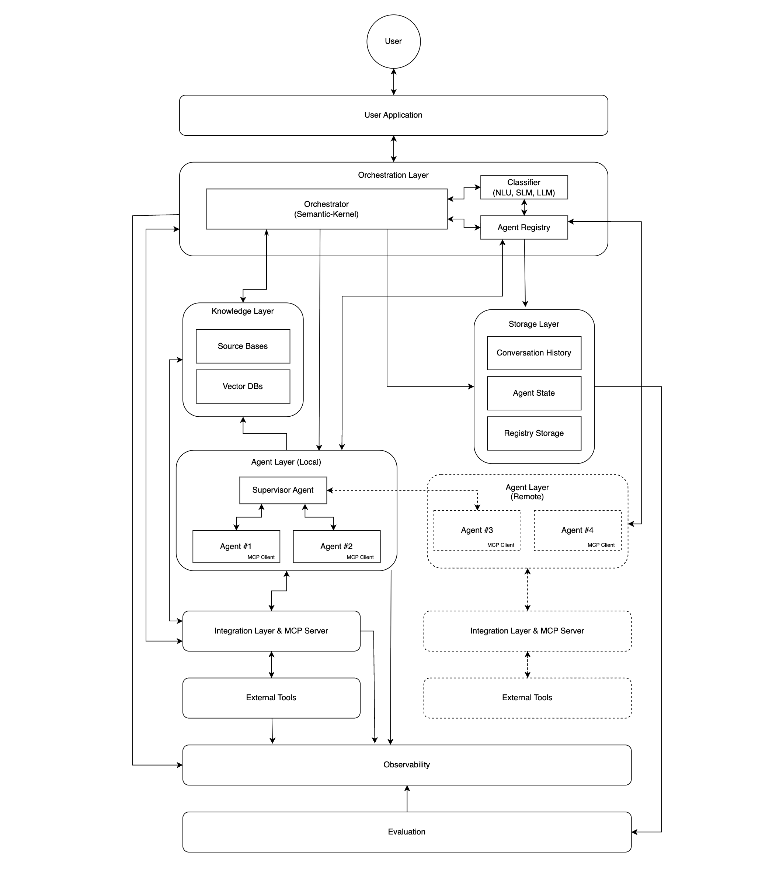
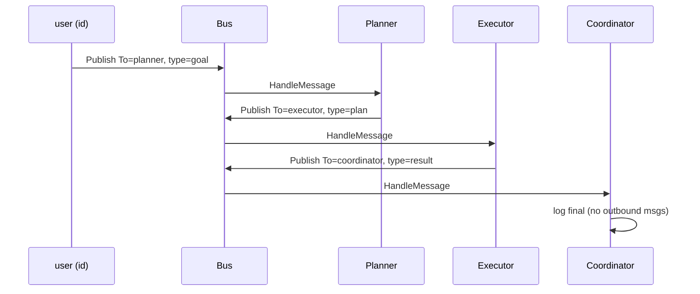
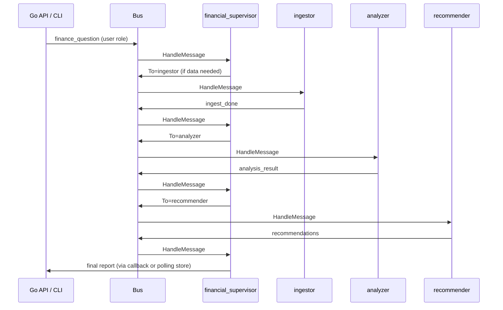

# 🧞 Genie — AI Financial Assistant (Go)

> **Genie** is an open-source **AI financial assistant** implemented in **Go**, following Microsoft’s [**Multi-Agent Reference Architecture (MARA)**](https://microsoft.github.io/multi-agent-reference-architecture/index.html): orchestration, agent registry, message-driven specialists, governance, memory, observability, and evaluation.


**Repository:** https://github.com/c2siorg/genie

---

## Architecture diagram

This repository includes a **high-level architecture image** at the repo root: [`Architecture.png`](./Architecture.png) (PNG). It visualizes how **Genie** (financial copilot) sits on the same **multi-agent** structure described in Microsoft’s [Multi-Agent Reference Architecture](https://microsoft.github.io/multi-agent-reference-architecture/index.html): user-facing entry, orchestration, specialist agents, shared data, and governed tool access.

<p align="center">
  <a href="./Architecture.png" title="Open full-size Architecture.png">
    
  </a>
</p>

**How to read this diagram with the code**

| Area you see on the diagram | What it is in Genie | Where it lives in Go |
| --- | --- | --- |
| User / client / API | Entry that publishes the first `protocol.Message` | Today: `cmd/demo` · later: `cmd/api` or similar |
| Orchestrator / coordination | Subscribes agents, runs governance, calls `HandleMessage`, republishes outputs | `pkg/orchestration` |
| Message bus / event path | Routes by `Message.To` (agent ID) | `pkg/comm` |
| Agent registry | Lists agents and resolves capabilities | `pkg/registry` |
| Specialist agents | Planner, executor, or future ingestor / analyzer / recommender | `cmd/demo` agents · future `agents/` |
| Governance / policy | Allow/deny before an agent sees a message | `pkg/governance` |
| Memory / state | Short- or long-term context (KV today) | `pkg/memory` (+ DB when added) |
| Observability / evaluation | Logs, clocks, interaction records | `pkg/observability`, `pkg/eval` |
| Knowledge / storage / tools | Ledger, docs, MCP-style integrations | Planned: PostgreSQL, RAG, tool adapters via `Environment` |

When you open a pull request that changes behavior, **update `Architecture.png`** if the box-level architecture changes so this image stays the single visual source of truth for newcomers.

---

## Start here (new contributors)

Read this README in order. You do **not** need prior LLM framework experience; you **do** need basic Go and the idea that **agents coordinate by sending messages**, not by calling each other’s functions directly.

### The one-sentence model

**A user (or API) publishes a message → the orchestrator delivers it to the right agent → the agent returns zero or more new messages → the orchestrator publishes those → the workflow continues until no more messages are emitted.**

That pattern is exactly what [MARA’s building blocks](https://microsoft.github.io/multi-agent-reference-architecture/docs/building-blocks/Building-Blocks.html) describe: an **orchestrator**, **specialized agents**, a **registry**, and shared **memory** / **governance** / **observability**.

### What is implemented today vs planned

| Layer | Status | Where |
| --- | --- | --- |
| **Platform (MARA)** | Implemented | `pkg/protocol`, `pkg/agent`, `pkg/registry`, `pkg/comm`, `pkg/orchestration`, `pkg/governance`, `pkg/observability`, `pkg/memory`, `pkg/eval` |
| **Demo workflow** | Implemented | `cmd/demo` (planner → executor → coordinator) |
| **Genie financial agents** | Planned | `agents/` (ingestor, analyzer, recommender, …) |
| **HTTP API / UI** | Planned | Can be a thin Go service that only publishes messages to the bus |

### Run the demo in 30 seconds

```bash
go run ./cmd/demo
go test ./...
```

You should see logs like:

```
[planner] received: draft a short plan for a new feature launch
[executor] executing: Plan for goal '...': ...
[coordinator] final result: Executed plan derived from: ...
```

That is a **full multi-agent flow** using the same machinery you will use for financial analysis.

---

## What is Genie?

**Product vision:** Genie helps people answer *“What should I do with my money?”* — not only *“What did I spend?”*

It does that by combining:

1. **Deterministic finance logic** (aggregations, trends, forecasts, rules).
2. **Specialist agents** (ingestion, analysis, recommendations), each with a narrow job.
3. **Orchestrated, governed message flows** so every step is traceable and safe.

**Engineering reality in this repo:** Genie is a **Go codebase** that implements the **multi-agent platform** from [MARA](https://microsoft.github.io/multi-agent-reference-architecture/index.html). Financial behavior lives in **agents you add**; the platform stays stable.

---

## Why MARA (and not “one big LLM call”)?

Microsoft’s guide focuses on systems where **many specialized agents** interact. The hard problems are not “write a prompt,” but:

- **Routing** — which agent should handle this request?
- **Decomposition** — who does step 1 vs step 2?
- **Governance** — what is allowed before any agent runs?
- **State** — conversation history, agent state, registry metadata.
- **Operations** — logs, traces, evaluation, security, rollback.

MARA documents these for production-scale systems. Genie adopts the same structure so finance features (CSV ingest, overspend analysis, forecasts) do not collapse into one unmaintainable module.

**Further reading:** [MARA overview](https://microsoft.github.io/multi-agent-reference-architecture/index.html) · [Reference Architecture chapter](https://microsoft.github.io/multi-agent-reference-architecture/docs/reference-architecture/Reference-Architecture.html)

---

## MARA concepts → Go packages

This table is the **map of the codebase**. Each row is a MARA idea; the **Go package** is where it lives.

| MARA concept | What it does | Go package | Key types |
| --- | --- | --- | --- |
| **Message / protocol** | Common wire format for all interaction | `pkg/protocol` | `Message`, `MessageRole`, `NewMessage` |
| **Agent** | Domain worker: handle one message, emit follow-ups | `pkg/agent` | `Agent`, `Environment` |
| **Agent registry** | Who exists? What can they do? | `pkg/registry` | `Registry`, `InMemoryRegistry`, `FindByCapability` |
| **Communication bus** | Deliver messages to subscribers | `pkg/comm` | `Bus`, `InMemoryBus` |
| **Orchestrator** | Subscribe agents, apply policy, dispatch | `pkg/orchestration` | `Orchestrator`, `SimpleEnvironment` |
| **Governance** | Allow/deny messages at the boundary | `pkg/governance` | `Policy`, `CompositePolicy`, `MaxContentLengthPolicy` |
| **Memory** | Short/long-term storage hooks | `pkg/memory` | `KeyValueStore`, `InMemoryKV` |
| **Observability** | Logging, time (testable clocks) | `pkg/observability` | `Logger`, `Clock` |
| **Evaluation** | Record runs for offline/online eval | `pkg/eval` | `InteractionRecord`, `Store` |

MARA also describes components you will **add for Genie** (not all are code yet):

| MARA concept | Genie role | Planned location |
| --- | --- | --- |
| **User application** | CLI, HTTP API, dashboard | `cmd/api`, `dashboard/` |
| **Classifier** | Route “forecast” vs “overspend” vs “simulate cancel” | Router agent or `pkg/classifier` |
| **Supervisor agent** | Break complex questions into sub-tasks | `agents/financial_supervisor` |
| **Knowledge layer** | Categories, merchant dictionaries | DB + optional vector index |
| **MCP / tools** | DB queries, model calls, simulators | Tools via extended `Environment` |

The table above matches the **boxes and flows** in [`Architecture.png`](#architecture-diagram); use the diagram for onboarding talks and the ASCII diagram below for exact Go package names.

---

## System diagram (how pieces connect)

```
                    ┌──────────────────────┐
                    │  cmd/demo or future  │
                    │  HTTP entrypoint     │
                    │  bus.Publish(msg)    │
                    └──────────┬───────────┘
                               │
                    ┌──────────▼───────────┐
                    │  pkg/comm (Bus)      │
                    │  route by msg.To     │
                    └──────────┬───────────┘
                               │
         ┌─────────────────────┼─────────────────────┐
         │                     │                     │
┌────────▼────────┐   ┌────────▼────────┐   ┌──────▼──────┐
│ Orchestrator    │   │ Governance      │   │ Registry    │
│ subscribes each │   │ Evaluate()      │   │ List/Get/   │
│ agent ID        │   │ before Handle   │   │ FindByCap   │
└────────┬────────┘   └─────────────────┘   └─────────────┘
         │
         │  for each message to agent X:
         │    1) policy.Evaluate(msg)
         │    2) agent.HandleMessage(msg, env)
         │    3) bus.Publish(each output)
         │
┌────────▼────────────────────────────────────────┐
│  Specialist agents (demo or Genie)             │
│  planner, executor, ingestor, analyzer, ...      │
└────────────────────────────────────────────────┘
```

**Important rule from MARA:** agents should **not** call `otherAgent.HandleMessage()` directly. They **emit messages** addressed with `To: "other_agent_id"`. The orchestrator and bus handle delivery. That keeps coupling low and matches [agents communication](https://microsoft.github.io/multi-agent-reference-architecture/docs/agents-communication/Agents-Communication.html) guidance (message-driven, loosely coupled).

---

## Package guide (read before writing code)

### `pkg/protocol` — the wire format

Every package that touches messages imports `protocol` (or gets types via `pkg/agent` re-exports). This avoids **import cycles** (documented in `pkg/protocol/doc.go`).

```go
type Message struct {
    ID        string
    From      string
    To        string            // routing address = agent ID
    Role      MessageRole       // user | system | agent | tool | observer | evaluator
    Type      string            // handler branch, e.g. "goal", "plan", "ingest"
    Content   string            // payload (often JSON for finance data)
    CreatedAt time.Time
    Metadata  map[string]any    // trace_id, account_id, etc.
}
```

**Roles** matter for observability and policy:

| Role | Typical use |
| --- | --- |
| `user` | End-user intent |
| `agent` | Plans, delegations, analysis results |
| `tool` | Output from DB/API/model tools |
| `system` | Control-plane instructions |
| `observer` | Audit/telemetry events |
| `evaluator` | Rubric or automated judgment |

**Contributor tip:** put structured finance data in `Content` as JSON and use `Type` to select the handler branch inside `HandleMessage`.

---

### `pkg/agent` — the worker contract

```go
type Agent interface {
    ID() string
    Name() string
    Capabilities() []string
    HandleMessage(ctx context.Context, msg Message, env Environment) ([]Message, error)
}
```

- **`ID()`** is the **routing address**. It must match `Message.To` when someone sends work to this agent.
- **`Capabilities()`** is how the registry supports **capability-based discovery** (MARA [Agent Registry](https://microsoft.github.io/multi-agent-reference-architecture/docs/agent-registry/Agent-Registry.html)).
- **`HandleMessage`** returns **0..N messages**. Zero means “done, no follow-up.” Multiple messages mean fan-out.

`Environment` is intentionally minimal (`Now`, `Logf`). Production Genie code extends it with memory, DB, and tool clients **without** changing the `Agent` interface (composition over bloat).

---

### `pkg/registry` — discovery

```go
type Registry interface {
    Register(ctx context.Context, a agent.Agent) error
    Get(ctx context.Context, id string) (agent.Agent, error)
    List(ctx context.Context) []agent.Agent
    FindByCapability(ctx context.Context, capability string) []agent.Agent
}
```

**MARA alignment:** registry answers *“which agents exist and what can they do?”* It does **not** transport messages—that is the bus.

**Contributor flows:**

- Register all agents **before** `orch.Start(ctx)`.
- Use `FindByCapability("analyze_spending")` in a supervisor or router agent to pick specialists dynamically.

---

### `pkg/comm` — message bus

```go
type Bus interface {
    Subscribe(agentID string, h Handler) (unsubscribe func())
    Publish(ctx context.Context, msg protocol.Message)
}
```

`InMemoryBus` routing:

- If `msg.To` is set → deliver to subscribers registered for that ID.
- Also delivers to **broadcast** subscribers (`agentID == ""`).

Handlers run in **goroutines** (async). The demo sleeps 2 seconds so `main` does not exit early; production should use completion signals or contexts.

**Swapping implementations:** Kafka/NATS/RabbitMQ can implement `Bus` without changing agent code—only wiring in `main`.

---

### `pkg/orchestration` — the coordinator

`Orchestrator.Start`:

1. `List()` all agents from the registry.
2. For each agent ID, `bus.Subscribe(agentID, handler)`.
3. On each message:
   - Run `policy.Evaluate(msg)` → deny stops processing.
   - Call `agent.HandleMessage`.
   - `Publish` every returned message back to the bus.

The orchestrator is **generic**—no finance logic inside. That matches MARA’s orchestrator role ([Reference Architecture](https://microsoft.github.io/multi-agent-reference-architecture/docs/reference-architecture/Reference-Architecture.html)).

---

### `pkg/governance` — safety at the boundary

Policies implement:

```go
Evaluate(ctx context.Context, msg protocol.Message) (PolicyResult, error)
```

`CompositePolicy` denies if **any** child denies. The demo uses `MaxContentLengthPolicy{Max: 4096}`.

**Why before `HandleMessage`?** So agents never see illegal payloads—aligned with MARA [Security](https://microsoft.github.io/multi-agent-reference-architecture/docs/security/Security.html) and [Governance](https://microsoft.github.io/multi-agent-reference-architecture/docs/governance/Governance.html).

**Genie examples to add:**

- Deny messages missing `metadata["account_id"]` for PII-bearing types.
- Deny `tool:*` message types from agents without `capability:invoke_tool`.

---

### `pkg/memory`, `pkg/observability`, `pkg/eval` — extension points

| Package | Purpose today | Genie direction |
| --- | --- | --- |
| `memory` | `KeyValueStore` / `InMemoryKV` | STM: session scratchpad; LTM: goals, aliases ([MARA Memory](https://microsoft.github.io/multi-agent-reference-architecture/docs/memory/Memory.html)) |
| `observability` | `Logger`, `Clock` | Structured logs with `trace_id`, OpenTelemetry later ([MARA Observability](https://microsoft.github.io/multi-agent-reference-architecture/docs/observability/Observability.html)) |
| `eval` | `InteractionRecord`, `InMemoryStore` | Golden-month tests, regression metrics ([MARA Evaluation](https://microsoft.github.io/multi-agent-reference-architecture/docs/evaluation/Evaluation.html)) |

Wire these through a richer `Environment` implementation, not inside individual agents’ global state.

---

## Walkthrough: `cmd/demo` (line by line)

Open `cmd/demo/main.go` alongside this section.

### Step 1 — Environment

```go
logger := observability.NewStdLogger()
env := &orchestration.SimpleEnvironment{Logger: logger, Clock: observability.SystemClock{}}
```

Agents log through `env.Logf`. Tests can inject a fake `Clock`.

### Step 2 — Platform

```go
reg := registry.NewInMemory()
bus := comm.NewInMemoryBus()
policy := governance.NewComposite(governance.MaxContentLengthPolicy{Max: 4096})
```

Three separate concerns: **discovery**, **transport**, **policy**.

### Step 3 — Agents and registration

```go
planner := &planningAgent{id: "planner"}
executor := &executorAgent{id: "executor"}
coord := &coordinatorAgent{id: "coordinator"}
reg.Register(ctx, planner)
reg.Register(ctx, executor)
reg.Register(ctx, coord)
```

IDs **`planner`**, **`executor`**, **`coordinator`** are routing addresses.

### Step 4 — Start orchestration

```go
orch := orchestration.NewOrchestrator(reg, bus, policy, env)
orch.Start(ctx)
```

This wires subscriptions. No messages have flowed yet.

### Step 5 — Kick off with one user message

```go
start := agent.NewMessage("user", "planner", agent.RoleUser, "goal", "draft a short plan...", nil)
bus.Publish(ctx, start)
```

Sequence:



**Notice:** `planningAgent` never imports `executorAgent`. It only creates a message with `To: "executor"`. That is the pattern every Genie agent must follow.

---

## How a Genie financial request will work (target)

Same platform, different agents:



MARA’s **supervisor** role ([Reference Architecture](https://microsoft.github.io/multi-agent-reference-architecture/docs/reference-architecture/Reference-Architecture.html)): decompose, delegate, merge, ensure coherence—implemented as `financial_supervisor` agent logic, not inside `Orchestrator`.

---

## Genie specialist agents (what to build)

Each row is a **cohesive capability** (MARA: do not make “call one API” its own agent).

| Agent ID | Capability strings | Responsibility |
| --- | --- | --- |
| `ingestor` | `ingest_csv` | Parse uploads, emit row events |
| `normalizer` | `normalize` | Bank-specific CSV → canonical ledger JSON |
| `enricher` | `enrich_merchant` | Merchants, categories |
| `analyzer` | `analyze_spending` | Windows, MoM deltas, overspend |
| `forecaster` | `forecast_cashflow` | Forward balances, scenarios |
| `anomaly_detector` | `detect_anomaly` | Outliers and alerts |
| `recommender` | `recommend`, `simulate_action` | Ranked actions + impact |
| `reporter` | `render_report` | Human-readable + JSON sections |
| `financial_supervisor` | `supervise_finance` | Multi-step orchestration at agent level |

**Example message** (future):

```json
{
  "from": "user",
  "to": "financial_supervisor",
  "role": "user",
  "type": "finance_question",
  "content": "Where am I overspending vs last month?",
  "metadata": {
    "account_id": "acct-123",
    "trace_id": "tr-abc",
    "from_date": "2026-01-01",
    "to_date": "2026-01-31"
  }
}
```

---

## Canonical finance data (for agents)

Normalized transaction (use in `Content` JSON):

```json
{
  "transaction_id": "txn-0001",
  "account_id": "acct-123",
  "date": "2026-01-03",
  "amount_cents": -45000,
  "currency": "INR",
  "description": "Swiggy order",
  "merchant": "swiggy",
  "category": "food:delivery"
}
```

Sample CSV in `data/` (when added):

```csv
date,description,category,amount,type
2026-01-01,Salary,Income,50000,credit
2026-01-03,Swiggy,Food,450,debit
```

---

## MARA chapters — what to read and when

| MARA chapter | Link | When you need it |
| --- | --- | --- |
| Overview | [index](https://microsoft.github.io/multi-agent-reference-architecture/index.html) | First day — vocabulary |
| Building blocks | [Building blocks](https://microsoft.github.io/multi-agent-reference-architecture/docs/building-blocks/Building-Blocks.html) | Before writing your first agent |
| Design options | [Design options](https://microsoft.github.io/multi-agent-reference-architecture/docs/design-options/Design-Options.html) | Choosing monolith vs splitting services |
| Agent registry | [Agent registry](https://microsoft.github.io/multi-agent-reference-architecture/docs/agent-registry/Agent-Registry.html) | Dynamic routing, capabilities |
| Memory | [Memory](https://microsoft.github.io/multi-agent-reference-architecture/docs/memory/Memory.html) | Sessions, user goals |
| Agents communication | [Agents communication](https://microsoft.github.io/multi-agent-reference-architecture/docs/agents-communication/Agents-Communication.html) | Bus vs direct RPC trade-offs |
| Observability | [Observability](https://microsoft.github.io/multi-agent-reference-architecture/docs/observability/Observability.html) | Logging, tracing |
| Evaluation | [Evaluation](https://microsoft.github.io/multi-agent-reference-architecture/docs/evaluation/Evaluation.html) | Tests and quality gates |
| Security | [Security](https://microsoft.github.io/multi-agent-reference-architecture/docs/security/Security.html) | PII, tool authz |
| Governance | [Governance](https://microsoft.github.io/multi-agent-reference-architecture/docs/governance/Governance.html) | Responsible AI, policies |
| Reference Architecture | [Reference Architecture](https://microsoft.github.io/multi-agent-reference-architecture/docs/reference-architecture/Reference-Architecture.html) | Full component diagram + supervisor |

---

## Repository layout

```
genie/
├── cmd/demo/           # Entrypoint: wires platform + demo agents
├── pkg/
│   ├── protocol/       # Message schema (shared wire format)
│   ├── agent/          # Agent + Environment interfaces
│   ├── registry/       # Agent discovery
│   ├── comm/           # Bus (in-memory; swappable)
│   ├── orchestration/  # Orchestrator
│   ├── governance/     # Policies
│   ├── observability/  # Logger, Clock
│   ├── memory/         # KV store abstraction
│   └── eval/           # Evaluation records
├── agents/             # (planned) Genie financial specialists
├── data/               # (planned) sample CSV / fixtures
├── tests/
└── docs/
```

**Module path:** `github.com/PratikDhanave/multi-agent-reference-architecture-go` (see `go.mod`).

---

## Add your first Genie agent (tutorial)

### 1. Create a new file `agents/analyzer/analyzer.go`

```go
package analyzer

import (
    "context"

    "github.com/PratikDhanave/multi-agent-reference-architecture-go/pkg/agent"
)

type Agent struct{}

func (a *Agent) ID() string   { return "analyzer" }
func (a *Agent) Name() string { return "Spending Analyzer" }
func (a *Agent) Capabilities() []string {
    return []string{"analyze_spending"}
}

func (a *Agent) HandleMessage(ctx context.Context, msg agent.Message, env agent.Environment) ([]agent.Message, error) {
    env.Logf("[analyzer] type=%s from=%s", msg.Type, msg.From)
    // TODO: parse msg.Content / metadata, compute metrics
    out := agent.NewMessage(
        a.ID(),
        "financial_supervisor",
        agent.RoleAgent,
        "analysis_result",
        `{"overspend_categories":["food:delivery"]}`,
        msg.Metadata,
    )
    return []agent.Message{out}, nil
}
```

### 2. Register in `cmd/demo/main.go` (or a new `cmd/genie/main.go`)

```go
_ = reg.Register(ctx, &analyzer.Agent{})
```

### 3. Send a message in tests or main

```go
bus.Publish(ctx, agent.NewMessage("user", "analyzer", agent.RoleUser, "analyze_spending", "{}", map[string]any{
    "account_id": "acct-123",
    "trace_id":   "test-1",
}))
```

### 4. PR checklist

- [ ] Unit test for `HandleMessage` (table-driven on `msg.Type`)
- [ ] Capability string documented in README agent table
- [ ] No direct calls to other agents—only outbound messages
- [ ] Governance considered (payload size, required metadata)
- [ ] Logs use `env.Logf`, not fmt in library code

---

## Design rules (from MARA — follow these)

1. **Orchestrator coordinates; agents do not call each other.** Use `Message.To`.
2. **One agent = one meaningful capability**, not one API endpoint.
3. **Registry for discovery; bus for delivery.** Do not mix the two.
4. **Governance runs before `HandleMessage`.** Fail closed.
5. **Prefer message-driven flows** for multi-step work; use a supervisor agent to plan steps.
6. **Version agents and prompts**; support rollback when eval metrics drop ([MARA Security](https://microsoft.github.io/multi-agent-reference-architecture/docs/security/Security.html)).
7. **Finance safety:** recommendations are informational; never log raw account numbers—hash or tokenize in `Metadata`.

---

## Roadmap

| Phase | Goal |
| --- | --- |
| **1** | `ingestor` + `normalizer` + `analyzer` on sample CSV |
| **2** | `forecaster`, `anomaly_detector`, `recommender` |
| **3** | `financial_supervisor` + classifier routing + eval golden files |
| **4** | Go HTTP API, persistence (PostgreSQL), optional dashboard |

---

## Contributing

- Issues: `good first issue`, `help wanted`
- **Good first tasks:** tests for `MaxContentLengthPolicy`; `analyzer` with fixture CSV; document one message type in `docs/messages.md`

**Mentor:** Pratik Dhanave · **Slack:** C2SI `#genie` · **Star:** https://github.com/c2siorg/genie

---

## References

- [Multi-Agent Reference Architecture (overview)](https://microsoft.github.io/multi-agent-reference-architecture/index.html)
- [Reference Architecture](https://microsoft.github.io/multi-agent-reference-architecture/docs/reference-architecture/Reference-Architecture.html)
- [Building blocks](https://microsoft.github.io/multi-agent-reference-architecture/docs/building-blocks/Building-Blocks.html)
- [Agent registry](https://microsoft.github.io/multi-agent-reference-architecture/docs/agent-registry/Agent-Registry.html)
- [Memory](https://microsoft.github.io/multi-agent-reference-architecture/docs/memory/Memory.html)
- [Agents communication](https://microsoft.github.io/multi-agent-reference-architecture/docs/agents-communication/Agents-Communication.html)
- [Observability](https://microsoft.github.io/multi-agent-reference-architecture/docs/observability/Observability.html)
- [Evaluation](https://microsoft.github.io/multi-agent-reference-architecture/docs/evaluation/Evaluation.html)
- [Security](https://microsoft.github.io/multi-agent-reference-architecture/docs/security/Security.html)
- [Governance](https://microsoft.github.io/multi-agent-reference-architecture/docs/governance/Governance.html)
- [Design options](https://microsoft.github.io/multi-agent-reference-architecture/docs/design-options/Design-Options.html)

---

## License / status

Reference **Go** implementation of MARA patterns for the Genie financial copilot. Extend agents and policies incrementally; keep the orchestration platform thin and stable.
