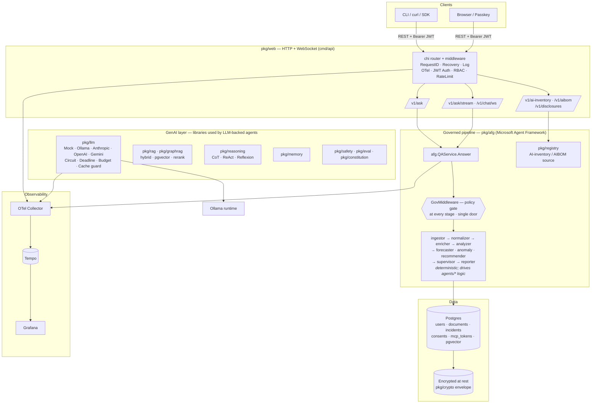

# Genie — AI Financial Assistant (Go)

> An **AI financial assistant** in Go, built on Microsoft's
> [Multi-Agent Reference Architecture (MARA)](https://microsoft.github.io/multi-agent-reference-architecture/index.html)
> and aligned with the **RBI FREE-AI** report (Aug 2025). Speaks **MCP** and **A2A**,
> runs **Ollama on-prem** by default, and bundles a full **GenAI engineering** layer
> (RAG, reasoning, memory, eval, safety, privacy).

[](https://dl.circleci.com/status-badge/redirect/gh/PratikDhanave/genie/tree/main)
[](https://goreportcard.com/report/github.com/PratikDhanave/genie)


[](LICENSE)

**60+ specialist finance agents** across the codebase (61 specialist packages under
`agents/`), **58 registered in the running API's governed inventory** plus 2 deterministic
fallbacks — covering retail finance, SME lending, KYC, bancassurance, fraud, treasury,
payments, and cyber. The `/v1/ask` money pipeline runs nine of them as governed stages;
`cmd/af-serve` serves the full governed catalog.

---

## Contents

- [Why Genie](#why-genie) · [Architecture](#architecture) · [Quick start](#quick-start) ·
  [Using the API](#using-the-api) · [Capabilities](#capabilities) ·
  [Governance & FREE-AI](#governance--free-ai) · [Documentation](#documentation) ·
  [Development](#development) · [Roadmap](#roadmap) · [Contributing](#contributing) ·
  [License](#license) · [References](#references)

---

## Why Genie

Genie answers *"What should I do with my money?"* by combining deterministic finance
logic with specialist agents: ingestion → normalisation → analysis → forecasting →
anomaly detection → recommendations. **Every step is a governed stage, every stage
passes through the same policy gate, every hop is traced.** The production API
(`cmd/api`) runs this pipeline on the [Microsoft Agent Framework](https://github.com/microsoft/agent-framework-go)
(`afg.QAService`); the CLI demo (`cmd/genie`) runs the original in-process message-bus
implementation, preserved as the reference design.

That shape — orchestration + registry + governance + memory + observability +
evaluation — is what MARA prescribes for production multi-agent systems, and what the
RBI FREE-AI report maps to its 7 Sutras, 6 Pillars, and 26 Recommendations. Money is
never computed by a model: rupee figures come from deterministic, tested integer-paise
math. The LLM reasons; the ledger counts.

---

## Architecture


```mermaid
flowchart TB
    subgraph Clients
        UA[CLI / curl / SDK]
        BR[Browser / Passkey]
    end

    subgraph Edge["pkg/web — HTTP + WebSocket (cmd/api)"]
        direction TB
        MW[chi router + middleware<br/>RequestID · Recovery · Log<br/>OTel · JWT Auth · RBAC · RateLimit]
        ASK[/v1/ask/]
        SSE[/v1/ask/stream · /v1/chat/ws/]
        INV[/v1/ai-inventory · /v1/aibom<br/>/v1/disclosures/]
    end

    subgraph Runtime["Governed pipeline — pkg/afg (Microsoft Agent Framework)"]
        QA[afg.QAService.Answer]
        GATE{{GovMiddleware — policy gate<br/>at every stage · single door}}
        STAGES[ingestor → normalizer → enricher → analyzer<br/>→ forecaster · anomaly · recommender<br/>→ supervisor → reporter<br/><i>deterministic; drives agents/* logic</i>]
        REG[pkg/registry<br/>AI-inventory / AIBOM source]
        QA --> GATE --> STAGES
    end

    subgraph AI["GenAI layer — libraries used by LLM-backed agents"]
        LLM[pkg/llm<br/>Mock · Ollama · Anthropic · OpenAI · Gemini<br/>Circuit · Deadline · Budget · Cache guard]
        RAG[pkg/rag · pkg/graphrag<br/>hybrid · pgvector · rerank]
        REAS[pkg/reasoning<br/>CoT · ReAct · Reflexion]
        MEM[pkg/memory]
        SAFE[pkg/safety · pkg/eval · pkg/constitution]
    end

    subgraph Data
        PG[(Postgres<br/>users · documents · incidents<br/>consents · mcp_tokens · pgvector)]
        VAULT[(Encrypted at rest<br/>pkg/crypto envelope)]
    end

    subgraph Observability
        OTLP[OTel Collector] --> TEMPO[(Tempo)] --> GRAF[Grafana]
    end

    OLLAMA[Ollama runtime]

    UA -->|REST + Bearer JWT| MW
    BR -->|REST + Bearer JWT| MW
    MW --> ASK --> QA
    MW --> SSE --> QA
    MW --> INV --> REG
    STAGES --> PG
    PG --> VAULT
    QA --> OTLP
    MW --> OTLP
    LLM --> OLLAMA
    LLM --> OTLP
```

For the production API (`cmd/api`), a `/v1/ask` request runs the **`afg.QAService`
pipeline** — nine governed [Microsoft Agent Framework](https://github.com/microsoft/agent-framework-go)
stages, each wrapped by the same policy gate (`GovMiddleware`, the *single construction
door*), producing a report byte-identical to the original bus pipeline (there is an oracle
parity test). The stages are deterministic and drive the real `agents/*` logic, so rupee
figures still come from tested integer-paise math, not a model. The in-process message
**bus** (`pkg/comm` + `pkg/orchestration` + `busio`) is the design used by the `cmd/genie`
CLI demo and preserved on the `legacy/bus-architecture` branch. The load-bearing packages:

| Package | Role |
| --- | --- |
| `pkg/afg` | Governed agent-framework pipeline (`QAService`) + single-door construction, `GovMiddleware`, `GuardMiddleware` — the `cmd/api` runtime |
| `pkg/protocol` | Wire format: `Message`, `Classification`, metadata keys |
| `pkg/governance` | Composite policy: RBAC, classification, residency, consent, PII, injection, schema |
| `pkg/registry` | AI-inventory / AIBOM source (drives `GET /v1/ai-inventory`) |
| `pkg/agent` | `Agent` + `Environment` + `RiskClass` |
| `pkg/comm` · `pkg/orchestration` | In-process message bus — the `cmd/genie` CLI / legacy design |

Full layer-by-layer map in **[docs/architecture.md](docs/architecture.md)**.

---

## Quick start

**CLI demo — zero external dependencies.** Runs the full bus pipeline in-process with
stdout OTel exporters.

```bash
git clone https://github.com/PratikDhanave/genie.git
cd genie
go test ./...            # all packages green (uses the mock provider)
go run ./cmd/genie       # full pipeline → console
```

**Full stack via docker-compose** — API, Postgres, Ollama, and the observability stack:

```bash
make up      # build, boot, wait for /readyz, print URLs
make down    # tear down
```

| Service | URL | Purpose |
| --- | --- | --- |
| `genie-api` | <http://localhost:8080> | the service (UI at `/`) |
| `postgres` | localhost:5432 | persistence |
| `ollama` | localhost:11434 | on-prem LLM runtime |
| `grafana` | <http://localhost:3000> | traces via Explore → Tempo (`genie-api`) |

See **[docs/operations.md](docs/operations.md)** for env vars, deployment, and runbooks.

---

## Using the API

```bash
# 1) Sign up → JWT
TOKEN=$(curl -s -X POST localhost:8080/v1/users \
  -H 'Content-Type: application/json' \
  -d '{"email":"alice@example.com","name":"Alice","password":"hunter2hunter2"}' \
  | jq -r .token)

# 2) Upload an encrypted CSV
DOC_ID=$(curl -s -X POST 'localhost:8080/v1/documents?description=Jan%20statement&classification=pii' \
  -H "Authorization: Bearer $TOKEN" --data-binary @data/sample.csv | jq -r .id)

# 3) Ask Genie
curl -s -X POST localhost:8080/v1/ask \
  -H "Authorization: Bearer $TOKEN" -H 'Content-Type: application/json' \
  -d "{\"question\":\"Where am I overspending?\",\"document_id\":\"$DOC_ID\"}" | jq .
```

`/v1/ask/stream` streams the same run as Server-Sent Events (AI disclosure → trace →
progress → final report); `/v1/chat/ws` is a bidirectional WebSocket. Every `/v1/ask`
appears in Grafana as one distributed trace across the HTTP server, the governed
pipeline, and each stage. Full endpoint reference: **[docs/api.md](docs/api.md)** ·
[`docs/openapi.yaml`](docs/openapi.yaml).

---

## Capabilities

Each capability is a package with a dedicated design doc under
[`docs/packages/`](docs/packages/README.md):

- **Agents** — 58 governed specialist agents in the AI inventory (ingestion, forecasting,
  anomaly, KYC, claims, SME lending, tax, portfolio, payments, cyber) plus 2 deterministic
  fallbacks. The `/v1/ask` money pipeline runs 9 of them as governed stages; `cmd/af-serve`
  exposes the full governed catalog. → [docs/agents](docs/agents/README.md)
- **LLM providers** — Mock · Ollama · Anthropic · OpenAI · Gemini, wrapped in
  Cache → Budget → Deadline → Circuit layers that bound autonomous reasoning.
- **Retrieval** — hybrid RAG + GraphRAG over pgvector, with rerank, Self-RAG, and CRAG.
- **Reasoning** — CoT, ReAct, Reflexion, Chain-of-Verification, Step-Back, semantic router.
- **Memory** — semantic + episodic + LLM summarisation + append-only long-term facts.
- **Safety & eval** — jailbreak/topic/toxicity/bias filters; RAGAS, drift, hallucination, Elo.
- **Auth** — JWT + bcrypt RBAC (wired into the API). OAuth 2.1, RFC 8628 device flow, and
  WebAuthn passwordless ship as `pkg/auth` libraries, not mounted in the default router.
- **Privacy & crypto** — AES-256-GCM envelope encryption, HMAC tokenisation, DP noise.
- **Protocols** — MCP (Zerodha Kite), A2A, CloudEvents, AsyncAPI, OpenInference. → [docs/protocols.md](docs/protocols.md)
- **Sovereignty & supply chain** — data-residency tags, on-prem inference, federated
  learning, AIBOM (CycloneDX 1.6 + Sigstore), DIDs + Verifiable Credentials.

---

## Governance & FREE-AI

Governance is **data, not code**. A board-approved policy YAML
([`config/ai-policy.example.yaml`](config/ai-policy.example.yaml)) is enforced by a
composite policy chain on *every* message — length, required metadata, RBAC,
classification ceiling, data residency, consent, explainability, PII regex,
prompt-injection, and JSON-schema checks — deny-on-first-failure. High-risk agents
(AML, VaR, KYC, payments) refuse to run without an `advisor`/`admin` role.

Every RBI FREE-AI recommendation maps to a concrete file path in
**[docs/free-ai-mapping.md](docs/free-ai-mapping.md)**. Two of the tooling seams:

```bash
make red-team    # adversarial probe corpus against the board policy (Rec 20)
make bcp-drill   # force a primary failure to verify the fallback fires (Rec 21)
```

---

## Documentation

Deep reference lives in **[`docs/`](docs/README.md)** — start there.

| Doc | Contents |
| --- | --- |
| [architecture.md](docs/architecture.md) | The governed `QAService` pipeline, packages, request lifecycle, and the legacy bus design |
| [operations.md](docs/operations.md) | Env vars, deployment, docker stack, runbooks |
| [api.md](docs/api.md) · [openapi.yaml](docs/openapi.yaml) | HTTP/WebSocket endpoints |
| [protocols.md](docs/protocols.md) · [asyncapi.yaml](docs/asyncapi.yaml) | MCP, A2A, CloudEvents |
| [free-ai-mapping.md](docs/free-ai-mapping.md) | Every FREE-AI recommendation → file path |
| [agents/](docs/agents/README.md) · [packages/](docs/packages/README.md) | Per-agent and per-package pages |

---

## Development

```bash
make build          # compile every binary under cmd/ into bin/
make test           # go test -race ./...   (the CI gate; also runs go vet)
make lint           # golangci-lint (strict; matches CI)
make run-cli        # CLI demo — no HTTP, Postgres, or LLM needed
make run-api-mock   # HTTP API with the mock LLM (needs Postgres + JWT/KEK env)
make scaffold name=<id> cap=<capability> in=<intype> out=<outtype> next=<agent>
```

> **Module path ≠ repo name.** The directory is `genie`, but the Go module is
> `github.com/PratikDhanave/multi-agent-reference-architecture-go` — import packages by the
> module path (e.g. `.../multi-agent-reference-architecture-go/pkg/afg`), never `genie`.

CI runs `go vet`, `golangci-lint`, and `go test -race` on Go 1.25, then a docker build on
`main`. Adding an agent, running a single test, and the full env reference are covered in
[`CLAUDE.md`](CLAUDE.md) and [docs/operations.md](docs/operations.md).

---

## Roadmap

Kafka/NATS bus transport · a real reranker model behind `rag.Reranker` (BGE, ColBERT) ·
a KMS-backed `crypto.KeyResolver` (AWS / GCP / Vault) · wiring the remaining implemented
agents into the API · richer Grafana dashboards. Contributions welcome — see
[Contributing](#contributing).

## Contributing

```bash
make vet && make test   # run all checks before pushing
```

New cross-cutting rules go into the composite policy (config YAML), not into agents;
new agents are message-driven and ship with a paired `docs/agents/<id>.md`. Details in
[`CLAUDE.md`](CLAUDE.md).

## License

**[PolyForm Noncommercial License 1.0.0](LICENSE)** — free for any noncommercial purpose
(personal, research, education, non-profit and government use). Commercial use is not
permitted. See [`LICENSE`](LICENSE) for the full terms.

> Note: releases prior to v1.0.0 were made available under the MIT License; that grant
> continues to apply to those earlier versions. Genie v1.0.0 onward is licensed under
> PolyForm Noncommercial 1.0.0.

## References

- [Multi-Agent Reference Architecture](https://microsoft.github.io/multi-agent-reference-architecture/index.html)
- [RBI FREE-AI report (Aug 2025)](https://rbidocs.rbi.org.in/rdocs/PublicationReport/Pdfs/FREEAIR130820250A24FF2D4578453F824C72ED9F5D5851.PDF)
- [Model Context Protocol](https://modelcontextprotocol.io/) · [Agent2Agent Protocol](https://github.com/google/a2a) · [CloudEvents](https://cloudevents.io/)
- [CycloneDX ML-BOM](https://cyclonedx.org/capabilities/mlbom/) · [OpenInference](https://github.com/Arize-ai/openinference) · [W3C DID Core](https://www.w3.org/TR/did-core/)
