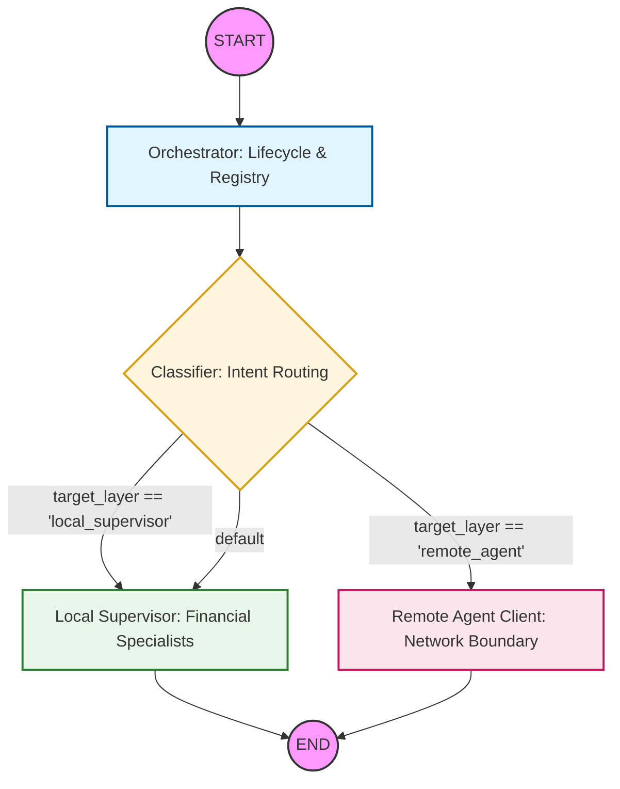

# Genie: Financial Multi-Agent System

This repository contains `genie_dummy`, a sophisticated Financial Transaction Analyst built on a **Modular Monolith** multi-agent framework using LangGraph. It strictly implements the Architectural Paradigms, incorporating tiered semantic routing, explicit Context Engineering, strict security gateways, and isolated storage domains.

## Core Architecture (The 7 Layers)

The system is rigorously isolated into seven functional boundaries to emulate a production-grade deployment. 

### 1. User Application Layer
*   **Location:** `/main.py`
*   **Role:** The frontend interface entry point. Handles data ingestion, redacts Personally Identifiable Information (PII) before storage, initiates semantic cache hits, and kicks off the multi-agent orchestration via the `SystemState`.

### 2. Orchestration Layer
*   **Location:** `/core/`
*   **Role:** The central nervous system. It strictly mediates all traffic. Agents *never* talk directly to each other or external networks without orchestrator permission.
    *   **`orchestrator.py`**: The Semantic Kernel. Checks agent capabilities via the registry, manages workflow lifecycles, and handles errors.
    *   **`classifier.py`**: The Semantic Router. Implements tiered routing from cheapest to most expensive (NLU Regex -> SLM Pattern -> LLM Deep Reasoning) to save token costs.
    *   **`registry.py`**: The Agent Registry. A mocked Document DB caching all agent capabilities, endpoint routes, security protocols, and version histories.
    *   **`graph.py`**: The literal LangGraph topology wiring the state edges together safely.

### 3. Agent Layer (Federated Model)
*   **Location:** `/agents/`
*   **Role:** The specialized processing experts applying logic to user requests.
    *   **`local/supervisor.py`**: The local coordinator. Breaks down complex financial analysis tasks, executes vector tool searches, hits the secure MCP gateway, initiates parallel **Fan-Outs** to financial experts, and executes a **Chained Sequence** to synthesize final recommendations.
    *   **`local/*_analysis.py`**: Independent domain experts (Spending Analysis, Anomaly Detection, Cash Flow Projection) evaluating isolated aspects of the transaction data concurrently.
    *   **`remote/remote_client.py`**: Network boundary abstraction for out-of-process agents.

### 4. Storage Layer
*   **Location:** `/storage/`
*   **Role:** Dedicated NO-SQL mapping patterns to persist sessions safely without cross-contamination.
    *   **`state.py`**: The overarching `SystemState`. Enforces the Short-Term Memory (STM) Document Schema. Interaction traces require rigid structures containing `session_id`, `message_id`, `user_id`, and `source` origins to generate explicit audit trails.

### 5. Integration Layer (Strict MCP)
*   **Location:** `/integration/`
*   **Role:** Ensures standardized, secured communication to the outside world using the Model Context Protocol (MCP).
    *   **`mcp_protocol.py`**: The explicit Security Gateway. Enforces Authentication (`Bearer` tokens) and Role-Based Access Control (RBAC) (e.g., verifying a local supervisor has clearance for a target database rule) before routing the payload to the specific internal tool adapter.

### 6. Knowledge Layer (Context Engineering)
*   **Location:** `/knowledge/`
*   **Role:** Domain-specific factual grounding (pgvector RAG) and prompt optimizations to save context tokens.
    *   **`vector_db.py`**: Implements **Semantic Caching** to bypass LLM logic for highly-repeated queries and **Tool Vector Servicing** to supply the Orchestrator with exactly the required MCP tools, rather than blind-injecting an entire tool catalog into context.

### 7. Observability & Evaluation Layer
*   **Location:** `/telemetry/`
*   **Role:** Governance, Traceability, and compliance audits
    *   **`observability.py`**: Contains strict `redact_pii` safeguards invoked by the user app, and `trace_execution`, which tags all LLM node execution paths with unique trace UUIDs matching an input identity hash against an output payload hash.
---

## Package Documentation

Each package in this project contains a `docs.py` file that provides a detailed
description of the package's purpose, its modules, public API, design decisions,
and extension points. These files are the **primary in-code documentation reference**
for contributors and maintainers.

| Package | `docs.py` Location | Covers |
|---|---|---|
| Root backend | [`docs.py`](./docs.py) | End-to-end workflow overview, package structure, quick start, design principles |
| `core/` | [`core/docs.py`](./core/docs.py) | Graph DAG topology, orchestrator lifecycle, 3-tier classifier (NLU → SLM → LLM), agent registry |
| `agents/local/` | [`agents/local/docs.py`](./agents/local/docs.py) | Supervisor fan-out, spending analysis, anomaly detection (rules + Isolation Forest), ARIMA/Prophet forecasting, reasoning LLM |
| `agents/remote/` | [`agents/remote/docs.py`](./agents/remote/docs.py) | Remote agent stub, intended production transport behaviour, routing context |
| `integration/` | [`integration/docs.py`](./integration/docs.py) | MCP gateway, authentication flow, RBAC enforcement, tool adapter dispatch |
| `knowledge/` | [`knowledge/docs.py`](./knowledge/docs.py) | Vector DB RAG pipeline — rule retrieval, dynamic tool search, semantic cache |
| `storage/` | [`storage/docs.py`](./storage/docs.py) | `Transaction`, `STM_Message`, `SystemState` TypedDicts with field-level descriptions |
| `telemetry/` | [`telemetry/docs.py`](./telemetry/docs.py) | `@trace_execution` decorator, prompt-injection safety guardrails, extension points |

> **Convention:** `docs.py` files contain only a module-level docstring — no executable code.
> They are safe to import and compatible with documentation generators (Sphinx, pdoc, mkdocstrings).

---

## Setup & Execution

### Prerequisites
Make sure you run this application inside the designated Python 3.10 Conda environment:
```bash
conda activate genie
pip install -r requirements.txt
```

### 1. Generate Synthetic Data
Before running the workflow, generate a large dataset (~2040 rows) with injected anomalies for testing:
```bash
python scripts/generate_transactions.py
```
This creates `data/transactions.csv`.

### 2. Running the System
Execute the full LangGraph workflow:
```bash
python main.py data/transactions.csv
```

### Expected Flow Trace:
1. `User App` isolates Data Payload by stripping PII.
2. `Knowledge Layer` checks Semantic Cache for bypass.
3. `Observability` spawns a deterministic Traceablity sequence for graph auditing.
4. `Orchestrator` aggregates the `Registry` capabilities.
5. `Classifier` successfully runs tiered intent routing to isolate the proper Supervisor.
6. `Supervisor` triggers a context vector search for required tools, executes via the strictly authenticated `MCP Gateway`, then parallelizes the work natively across specialized agents.
7. System generates aggregated financial insights perfectly isolated from LLM prompt leaking.


### Current Architecture:
