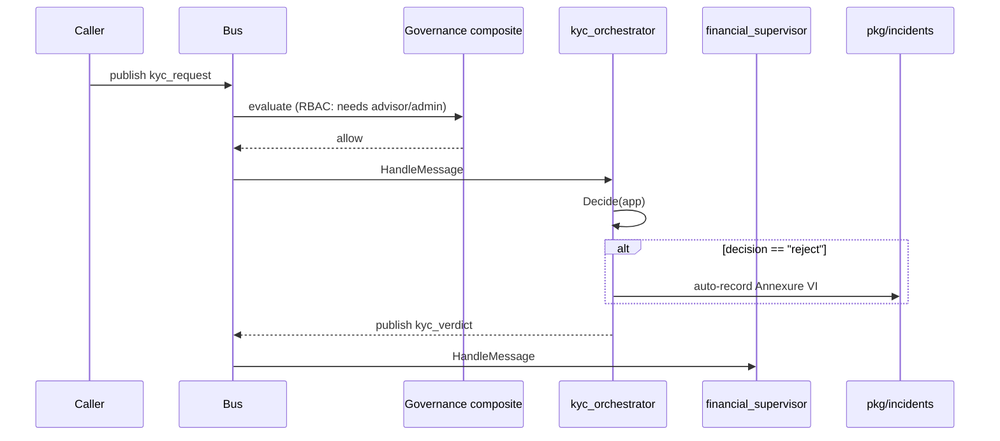

# agents/kyc_orchestrator

> **Risk class:** High · **Capability:** `orchestrate_kyc` · **In:** `kyc_request` · **Out:** `kyc_verdict`
> **Inspired by:** Google ADK `global-kyc-agent`, adapted for the Indian KYC stack.

---

## Overview

Sequences the deterministic checks that make up a full Indian KYC
workflow per the **RBI Master Direction on KYC**
(`DBR.AML.BC.No.81/14.01.001/2015-16`, updated 2024). Genie already had
`synthetic_identity` for *signal* detection on a KYC packet — this agent
runs the *workflow*: PAN structural validity → Aadhaar offline KYC →
DigiLocker → name match → liveness/V-CIP → PEP/sanctions → tiering into
**SDD** (Simplified Due Diligence), **standard**, or **EDD** (Enhanced
Due Diligence), with auto-reject on sanctions match and an Annexure VI
incident packet attached.

Why an orchestrator and not 8 separate agents? Because the *sequence* is
the regulated artefact. RBI inspects "what was checked, in what order,
with what thresholds." That sequence lives in one Go file, with one set
of unit tests, that the compliance team can read end-to-end without
hopping between packages.

---

## Constants

```go
const (
    ID         = "kyc_orchestrator"
    Capability = "orchestrate_kyc"
    TypeIn     = "kyc_request"
    TypeOut    = "kyc_verdict"
    NextAgent  = "financial_supervisor"

    scoreEDD = 0.70 // ≥ score → Enhanced Due Diligence
    scoreSDD = 0.30 // ≤ score → Simplified Due Diligence
)
```

The two thresholds are intentionally separate so the risk team can tune
them via the board-approved policy (FREE-AI Rec 6) without code release.

---

## Risk class

`RiskLevel() agent.RiskClass → agent.RiskHigh`

Means: the orchestrator cannot execute on a message whose
`metadata.user_roles` does not contain `advisor` or `admin`. The
governance composite enforces this *before* `HandleMessage` runs.

---

## Request / Response types

### Application (inbound)

```go
type Application struct {
    CustomerID         string  // your internal customer id
    PANNumber          string  // 10 chars
    NameOnPAN          string
    AadhaarLast4       string  // never the full number on the bus
    AadhaarOfflineKYC  bool    // user supplied UIDAI XML
    NameOnAadhaar      string
    DigiLockerVerified bool
    AddressMatchScore  float64 // 0..1, fuzzy match confidence
    LivenessScore      float64 // 0..1, from V-CIP / passive liveness
    PEPHit             bool    // Politically Exposed Person
    SanctionsHit       bool    // OFAC / UN / MHA
    CountryOfResidence string  // ISO 3166-1 alpha-2
    HighRiskCountry    bool    // FATF grey / black-list
    OccupationHighRisk bool    // arms, gambling, NGO, etc.
}
```

**Critical**: the full Aadhaar number must *never* cross the bus. Only
the last 4 digits are accepted. The orchestrator assumes upstream
ingestion has already redacted; if not, the `PIIBlockPolicy` will deny
the message at the governance layer.

### Verdict (outbound)

```go
type Verdict struct {
    CustomerID      string
    Decision        string   // "approve" | "edd" | "reject"
    Tier            string   // "sdd" | "standard" | "edd"
    RiskScore       float64  // 0..1
    Reasons         []string // explainability (FREE-AI Rec 25)
    NextSteps       []string // user-actionable
    IncidentPayload string   // Annexure VI on reject (FREE-AI Rec 22)
    Disclaimer      string
}
```

---

## Business rules

The scoring stack runs in order; each rule contributes to the risk score.

| # | Check | Score on hit | Source |
|---|---|---:|---|
| 1 | PAN structural validity (10 chars, 4th=P for individuals, 5th = first letter of surname) | +0.30 | Income-tax Act 1961 PAN format |
| 2 | Aadhaar offline KYC XML missing | +0.20 | UIDAI offline KYC mandate (post 2018 Supreme Court ruling) |
| 3 | Name on PAN does not share a token with name on Aadhaar | +0.20 | Common KYC failure mode |
| 4 | Address match below 0.80 confidence | +0.10 | Internal heuristic |
| 5 | Liveness score below 0.70 (and > 0 — 0 means no V-CIP attempted) | +0.15 | V-CIP best practice |
| 6 | Sanctions hit | **immediate reject (score = 1.0)** | OFAC SDN, UN consolidated list, MHA list |
| 7 | PEP hit | +0.35 | RBI Master Direction §V |
| 8 | High-risk country | +0.20 | FATF jurisdiction list |
| 9 | High-risk occupation | +0.10 | FATF guidance |

Final classification:

- `score ≥ 0.70` → **EDD tier**, decision = `edd` (refer to compliance for Enhanced Due Diligence)
- `score ≤ 0.30` → **SDD tier**, decision = `approve`
- otherwise → **standard tier**, decision = `approve`

Sanctions hit short-circuits everything: decision = `reject`, severity =
`high`, an Annexure VI form is generated, and the suggested next step is
"File STR with FIU-IND if confirmed sanctioned."

---

## Decision logic — the pure function

`Decide(app Application) Verdict` is a pure function. No goroutines, no
I/O, no LLM. That matters for three reasons:

1. **Auditability** — every input → output mapping is reproducible.
2. **Testability** — 9 unit tests exercise every branch (`agents/kyc_orchestrator/kyc_orchestrator_test.go`).
3. **Explainability** — every "+0.30" in the score traces back to a named rule with a regulatory citation.

The LLM never decides KYC. Genie can use an LLM downstream to render the
Verdict into a plain-language email — but the *decision* is the
deterministic function.

---

## Example

### Request

```json
{
  "customer_id": "cust-19283",
  "pan_number": "ABCPS1234F",
  "name_on_pan": "Asha Singh",
  "aadhaar_last4": "4321",
  "aadhaar_offline_kyc": true,
  "name_on_aadhaar": "Asha Singh",
  "digilocker_verified": true,
  "address_match_score": 0.92,
  "liveness_score": 0.88,
  "pep_hit": false,
  "sanctions_hit": false,
  "country_of_residence": "IN",
  "high_risk_country": false,
  "occupation_high_risk": false
}
```

### Verdict

```json
{
  "customer_id": "cust-19283",
  "decision": "approve",
  "tier": "sdd",
  "risk_score": 0.0,
  "reasons": [],
  "next_steps": [],
  "disclaimer": "Deterministic KYC risk score per RBI Master Direction. Not a substitute for compliance-officer review on EDD-tier outcomes."
}
```

### Sanctions reject example

```json
{
  "customer_id": "cust-77",
  "decision": "reject",
  "tier": "edd",
  "risk_score": 1.0,
  "reasons": ["Sanctions list hit (OFAC / UN / MHA)"],
  "next_steps": ["File STR with FIU-IND if confirmed sanctioned"],
  "incident_payload": "{\"annexure\":\"VI\",\"customer_id\":\"cust-77\",\"reason\":\"...\",\"severity\":\"high\",\"action_taken\":\"Auto-reject; refer to FIU-IND if confirmed.\"}",
  "disclaimer": "Auto-reject triggered by sanctions match; verify list version before final action."
}
```

---

## HandleMessage flow



---

## FREE-AI alignment

- **Rec 8 (Graded Liability)** — sanctions-hit → high-grade incident with Annexure VI payload.
- **Rec 14 (Board-Approved Policy)** — `scoreEDD` and `scoreSDD` are constants today; should move into `config/ai-policy.example.yaml` so the board owns them.
- **Rec 16 (Autonomous Systems)** — declared `RiskHigh`; orchestrator enforces role ceiling before dispatch.
- **Rec 18 (Disclosure)** — every Verdict carries a `Disclaimer` field.
- **Rec 22 (Annexure VI)** — rejection emits a structured `IncidentPayload` ready for the regulator's form.
- **Rec 25 (Disclosures)** — every score contribution is listed in `Reasons` for explainability.

---

## Integration

### Triggered by

- The HTTP edge (`POST /v1/kyc/start`) — implementation lives in the host application; the orchestrator is the worker.
- The customer-onboarding pipeline, which collects the `Application` fields from the UI/mobile flow.

### Hands off to

- `financial_supervisor` — for approved cases, kicks the standard money-flow pipeline.
- `pkg/incidents` — for rejects, auto-records the Annexure VI form.
- `agents/synthetic_identity` (optional, parallel) — for signal scoring as a second pair of eyes.

### Does NOT do

- **Live PAN/Aadhaar API calls** — those are pluggable interfaces the host wires (NSDL PAN API, UIDAI offline KYC eToken, DigiLocker OAuth). The orchestrator owns the *decision*, not the *fetch*.
- **Document OCR** — that's `agents/receipt_ocr` (for receipts) or a separate ID-card OCR (host concern).
- **CKYCR registry sync** — host concern.

---

## Anti-patterns

1. **Putting the full Aadhaar number on the bus.** Use the last 4 only. The `PIIBlockPolicy` will deny full-Aadhaar messages anyway.
2. **Treating EDD as a "soft" decision.** EDD means the case *must* be reviewed by a compliance officer. The agent's verdict is a recommendation; sign-off is human.
3. **Tweaking thresholds in code.** Move them to the policy YAML so the board can govern them.
4. **Skipping the orchestrator and calling individual checks ad-hoc.** The whole point is the sequence is the regulated artefact. Calling `panLooksValid()` in isolation outside this agent breaks the audit trail.
5. **Logging the full incident payload at INFO.** The payload contains the customer ID and reason. Log at DEBUG, or strip the customer ID, or route via the audit log only.

---

## Testing

`agents/kyc_orchestrator/kyc_orchestrator_test.go` covers:

| Test | Asserts |
|---|---|
| `TestCleanProfileApproves` | Clean profile lands in SDD tier with `approve` |
| `TestSanctionsAutoReject` | Sanctions hit → `reject` with Annexure VI payload |
| `TestPEPRoutesToEDD` | PEP + high-risk geo + occupation + weak address → EDD |
| `TestPANStructuralCheck` | 5th-char mismatch produces the expected reason |
| `TestMissingAadhaarOfflineKYC` | Missing XML appears in next steps |
| `TestNameMismatchCounted` | Name mismatch reason fires |
| `TestDisclaimerPresent` | Every verdict has a disclaimer |
| `TestHandleMessage_DispatchesDownstream` | The bus contract — dispatches `kyc_verdict` to `financial_supervisor` |
| `TestRiskClassIsHigh` | RiskHigh enforced |

Run:

```bash
go test ./agents/kyc_orchestrator/ -v
```

To add a new rule, write a new test case first (red), add the score
contribution in `Decide()`, then update this doc's "Business rules"
table.

---

## References

- [RBI Master Direction on KYC](https://rbi.org.in/Scripts/BS_ViewMasDirections.aspx) — the canonical Indian KYC playbook
- [UIDAI Offline KYC](https://uidai.gov.in/) — the e-Aadhaar XML format
- [FIU-IND STR/CTR reporting](https://fiuindia.gov.in/) — the Annexure VI escalation path
- [FATF jurisdiction list](https://www.fatf-gafi.org/en/publications/High-risk-and-other-monitored-jurisdictions.html) — used to seed `HighRiskCountry`
- [Income-tax Act 1961 PAN rules](https://www.incometax.gov.in/) — the PAN structural spec
