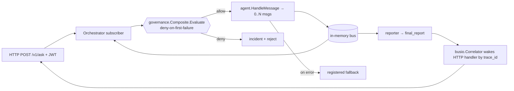
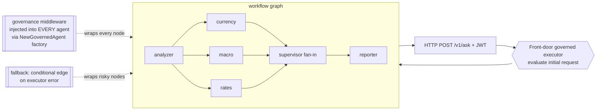
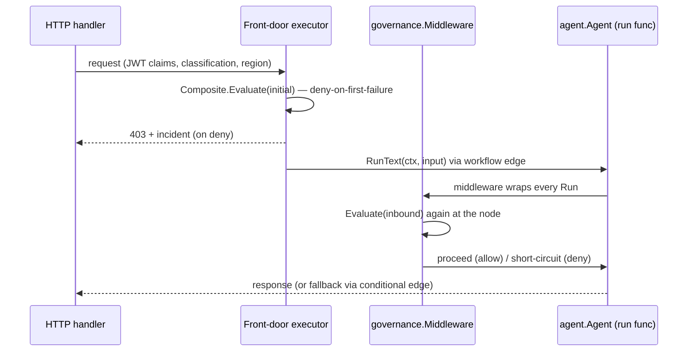
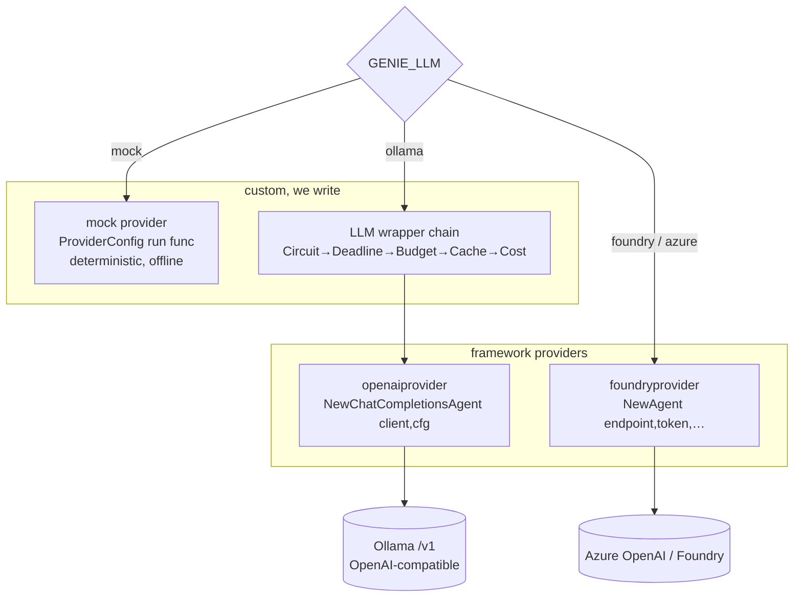

# Migration Design: Genie → Microsoft Agent Framework for Go

**Status:** DRAFT for approval — no code written yet.
**Decision on record:** full rewrite onto `github.com/microsoft/agent-framework-go`, keeping **both** provider paths (on-prem Ollama + offline mock *and* cloud Foundry/Azure OpenAI).
**Author:** migration advisory pass, 2026-07-11.

> This document follows the repo convention: Mermaid architecture + sequence diagrams and
> incremental design approval **before** code. Nothing here is implemented yet.

---

## 1. Honest risk statement (read this first)

We are replatforming a **shipped, documented v1.0.0** system (58 wired agents + full
governance/RAG/AIBOM stack) onto a framework that is, as of this writing:

- **Public preview**, **MIT**, **with no GitHub releases published** — the API can move under us.
- Missing, per Microsoft's own docs: **RAG, declarative agents, CodeAct, and functional workflows**.
- Cloud-first: the shipped Go providers are `foundryprovider`, `openaiprovider`,
  `anthropicprovider`, `geminiprovider`, `a2aprovider`, `aguiprovider`, `copilotprovider`,
  `otelprovider`. **No first-party Ollama or mock provider** — we write those ourselves.

**Implication:** the parts of Genie that carry the regulatory story (RBI FREE-AI: on-prem
default, governance gate, AIBOM/inventory, RAG grounding) are exactly the parts the framework
does **not** give us. We keep and re-host them; we do not get them for free. This is a
platform swap for the **orchestration and provider layers**, not for the compliance layer.

---

## 1.5 Phase 0 verification — VERIFIED AGAINST REAL SOURCE (2026-07-11)

The framework was fetched, pinned, compiled, and run. **Go/no-go: GO.** No blockers.
Pin these in genie's `go.mod` (no semver tags exist — pin the pseudo-version):

```
github.com/microsoft/agent-framework-go v0.0.0-20260710122455-75d0a647f739
github.com/openai/openai-go/v3          v3.41.1   // Ollama/OpenAI client; pin v3
```
Framework `go.mod` declares `go 1.25.0`; genie is already `go 1.25.0` — **no toolchain bump.**

**A compiled spike proved the two go/no-go killers + the governance gate** (output verbatim):
```
[1 mock]      text="hi from mock"    err=<nil>              # deterministic mock, no network
[2 gov allow] text="ALLOWED answer"  err=<nil>              # gate passes -> provider runs
[3 gov deny]  text=""                err=DENIED by gate     # gate short-circuits BEFORE provider
[4 ollama]    constructed OK         # openaiprovider + option.WithBaseURL compiles
```

**Corrected, compiled API (this supersedes any conflicting snippet below):**
```go
import (
    "context"; "iter"
    "github.com/microsoft/agent-framework-go/agent"
    "github.com/microsoft/agent-framework-go/message"
    "github.com/microsoft/agent-framework-go/provider/openaiprovider"
    openai "github.com/openai/openai-go/v3"
    "github.com/openai/openai-go/v3/option"
)

// deterministic mock provider (Genie `mock`) — RunFunc is a range-over-func iterator
func mockRun(canned string) agent.RunFunc {
    return func(ctx context.Context, msgs []*message.Message, opts ...agent.Option) iter.Seq2[*agent.ResponseUpdate, error] {
        return func(yield func(*agent.ResponseUpdate, error) bool) {
            yield(&agent.ResponseUpdate{Role: message.RoleAssistant,
                Contents: message.Contents{&message.TextContent{Text: canned}}}, nil)
        }
    }
}
// agent.New is the ONLY constructor; New panics if ProviderConfig.Run == nil.
mock := agent.New(agent.ProviderConfig{ProviderName: "genie-mock", Run: mockRun("hi")},
    agent.Config{Name: "hello"})
resp, err := mock.RunText(ctx, "q").Collect()   // .Collect() is on the returned ResponseStream

// governance gate — runs BEFORE the provider; denies by NOT calling next
type govMiddleware struct{ eval func([]*message.Message) error }
func (g govMiddleware) Run(next agent.RunFunc, ctx context.Context, msgs []*message.Message, opts ...agent.Option) iter.Seq2[*agent.ResponseUpdate, error] {
    if err := g.eval(msgs); err != nil {
        return func(yield func(*agent.ResponseUpdate, error) bool) { yield(nil, err) }
    }
    return next(ctx, msgs, opts...)
}

// Ollama via OpenAI-compatible /v1 — base URL is on the openai-go client, NOT framework config
client := openai.NewClient(option.WithBaseURL("http://localhost:11434/v1"), option.WithAPIKey("ollama"))
oll := openaiprovider.NewChatCompletionsAgent(client, openaiprovider.AgentConfig{
    Config: agent.Config{Name: "fx"}, Instructions: "…", Model: "llama3.1"})  // Instructions+Model are provider-level
```

**Four corrections to the sections below (do not copy the pre-Phase-0 snippets):**
1. `Instructions` is **not** on `agent.Config`; it's on `openaiprovider.AgentConfig` (or `agent.WithInstructions()`).
2. There is **no `agent.NewCustom` / `agent.Request`** — only `agent.New(prov, cfg)`; `Run` is `agent.RunFunc` (an `iter.Seq2` iterator).
3. `.Collect()` is on `ResponseStream` (returned by `Run*`), not on `Agent`.
4. Provider constructors auto-inject a tool-autocall middleware unless `agent.Config.DisableFuncAutoCall=true`; set it in Phase 1 to keep the gate strictly outermost. `foundryprovider.NewAgent`'s signature is still **UNVERIFIED** (Phase 3).

## 2. What the framework gives us (doc-level — see §1.5 for source-verified corrections)

| Concept | Go surface (verbatim) |
|---|---|
| Agent | `agent.Agent` with `Run`, `RunText`, `RunMessage`; results via `.Collect()` or streaming `for update, err := range ...` |
| Agent config | `agent.Config{ Name, Tools, Middlewares []agent.Middleware, ContextProviders, DisableFuncAutoCall, … }` — **no `Instructions`** (§1.5) |
| Provider extension point | `agent.ProviderConfig` — *"run function, session management"* (the seam for custom providers) |
| Cross-cutting seam | `agent.Middleware` (attached per-agent via `Config.Middlewares`) |
| Orchestration | `workflow.NewBuilder` — graph of executors joined by edges: sequential, concurrent, conditional routing, subworkflows |
| Sessions | `a.CreateSession(ctx)`, `agent.WithSession(session)` |
| Interop | `a2aprovider`, MCP, `aguiprovider` (AG-UI) as first-class |

Constructor shape we will mirror everywhere:

```go
a := foundryprovider.NewAgent(endpoint, token, foundryprovider.ModelDeployment(model),
    foundryprovider.AgentConfig{
        Instructions: "…",
        Config: agent.Config{
            Name:        "MyAgent",
            Tools:       []tool.Tool{myTool},
            Middlewares: []agent.Middleware{governance, tracing},
        },
    })
resp, err := a.RunText(ctx, "Hello!").Collect()
```

---

## 3. The core architectural shift

Genie today is a **message bus with a single governance chokepoint**. The framework is a
**workflow graph with per-agent middleware**. The rewrite's whole difficulty is re-proving
the single-gate property in a topology that has no single gate.

### 3.1 Current topology (bus, one seam)



One `Evaluate` call sits on **every** hop. Tracing, fallback routing, and the live
inventory all hang off that same bus seam.

### 3.2 Target topology (graph, seam re-imposed as mandatory middleware)



Key design rule: **`agent.Middleware` is per-agent, so the gate is only unbypassable if
construction is disciplined.** We enforce that with §6.

---

## 4. Component disposition — keep / re-host / rebuild / drop

| Genie asset | Disposition | Notes |
|---|---|---|
| `pkg/comm` in-memory bus, `pkg/orchestration` | **Replace** | Superseded by `workflow.NewBuilder` graph + edges |
| `pkg/busio.Correlator` (sync-over-async by trace_id) | **Replace** | Framework returns a response directly; `.Collect()` is the join |
| Fan-out/fan-in (analyzer→supervisor→reporter) | **Re-host** | Becomes concurrent workflow nodes + fan-in executor — cleaner |
| `pkg/governance` composite chain | **Re-host as middleware** | Same rules, wrapped in one `agent.Middleware` (§6) |
| `pkg/policy` (YAML → policy) + `config/ai-policy.example.yaml` | **Keep as-is** | Governance stays data-driven; loader feeds the middleware |
| 58 agents' `HandleMessage` logic | **Port** | Mechanical reshape to run-func / executor (§5) |
| `agents/fallback` deterministic notice | **Re-host** | Becomes conditional edge target + deterministic run func |
| `pkg/rag`, `pkg/graphrag` | **Keep as-is** | Framework RAG "not yet available"; wire via `ContextProviders`/tools |
| `pkg/reasoning` (ReAct/Reflexion) | **Keep, re-wrap** | Framework has tool-calling loop; keep our bounded loop where needed |
| `pkg/registry` + `/v1/ai-inventory` + AIBOM | **Rebuild** | No framework equivalent; keep our registry as the inventory source of truth |
| `pkg/auth`, `pkg/crypto`, `pkg/identity`, RBAC middleware | **Keep as-is** | HTTP edge unchanged; JWT/KEK/RBAC still ours |
| `pkg/web` (chi router, middleware, UI) | **Keep, re-point** | Handler calls the workflow instead of publishing to the bus |
| LLM wrapper chain (`Circuit→Deadline→Budget→Cache→Cost→Ollama`) | **Re-host** | Wrap the framework's chat client, not our old provider |
| `pkg/mcp`, `pkg/a2a` | **Replace with framework** | `a2aprovider` + MCP are first-class — net upgrade |
| `pkg/eval`, `pkg/safety`, `pkg/privacy`, `pkg/compliance` | **Keep as-is** | Orthogonal to orchestration |

---

## 5. Agent porting template

Three kinds of agents, three shapes.

**(a) LLM agent** (most specialists) — reshape `HandleMessage` into instructions + tools:

```go
// before: agents/currency/currency.go  HandleMessage(ctx, msg, env) ([]Message, error)
// after:  a governed constructor returning *agent.Agent (see verified forms in §1.5)
func New(client openai.Client) *agent.Agent {
    return NewGovernedOllamaAgent(client, "currency", currencyInstructions, "llama3.1")
    // NewGoverned* is the ONLY door (§6); it injects the gov gate into Config.Middlewares.
    // Instructions + Model are provider-level (openaiprovider.AgentConfig), NOT agent.Config.
}
```

**(b) Deterministic agent** (`fallback`, echo, offline modes) — a `ProviderConfig` run func,
no LLM, no network:

```go
func NewFallbackFor(primary string) *agent.Agent {           // real API — compiled in §1.5
    run := func(ctx context.Context, msgs []*message.Message, opts ...agent.Option) iter.Seq2[*agent.ResponseUpdate, error] {
        return func(yield func(*agent.ResponseUpdate, error) bool) {
            yield(&agent.ResponseUpdate{Role: message.RoleAssistant,
                Contents: message.Contents{&message.TextContent{Text: deterministicNotice(primary)}}}, nil)
        }
    }
    return agent.New(agent.ProviderConfig{ProviderName: "genie-fallback", Run: run}, agent.Config{Name: primary + "-fallback"})
}
```

**(c) Fan-in coordinator** (`supervisor`) — a workflow executor that waits for the expected
named fields per `trace_id` (structural readiness, unchanged semantics), then fires `reporter`.

---

## 6. THE critical bit — keeping the governance gate unbypassable

The framework gives us per-agent middleware, not a bus chokepoint. We reconstruct the
single-seam guarantee with **three enforced layers**:

1. **One construction door.** No agent is built with a raw `foundryprovider.NewAgent(...)`.
   Every agent is built by `NewGovernedAgent(cc, cfg)`, which injects the governance
   middleware (and tracing) into `cfg.Middlewares` before delegating to the provider.
2. **A front-door executor** evaluates the *initial* request once (the equivalent of the
   first bus hop), so policy runs even before the graph starts.
3. **A registry invariant test** (mirrors today's `tests/agents_registry/`): iterate every
   registered agent and assert its middleware chain contains the governance gate. CI fails
   if any agent was constructed by another path.



Governance stays **data, not code**: the YAML loader (`pkg/policy`) still assembles the
composite chain; only the *injection point* changes from bus to middleware.

---

## 7. Provider strategy (both paths, verified feasible)



- **mock** → custom `ProviderConfig.Run` returning canned/deterministic responses. Preserves
  `make run-api-mock` and offline tests — no external dependency.
- **ollama** → build `openai.NewClient(option.WithBaseURL("http://localhost:11434/v1"), …)`
  (openai-go/v3) and pass it **by value** to `openaiprovider.NewChatCompletionsAgent`. The
  base URL lives on the openai-go client, not the framework config. **Construction verified
  to compile (§1.5);** live tool-calling parity over Ollama's `/v1` still to be confirmed
  with a running Ollama (`OLLAMA_LIVE=1`).
- **cloud** → `foundryprovider` / `openaiprovider` (Azure). New capability, not a regression.
  ⚠️ `foundryprovider.NewAgent`'s exact signature is **UNVERIFIED** — source-check before Phase 3.

Embeddings stay on our own `rag.Embedder` (framework RAG is unavailable), unchanged.

---

## 8. Phased plan (approval gate at each phase boundary)

**Phase 0 — Repo + spike (½–1 wk).** Scaffold the new repo (see §9). Spike two things that
can kill the plan: (a) Ollama tool-calling through `openaiprovider`; (b) a mock
`ProviderConfig` run func. Deliverable: `hello-agent` running on mock **and** Ollama.

**Phase 1 — Vertical slice. ✅ DONE (2026-07-12), CI green.** Delivered in `pkg/afg/` +
`cmd/af-hello/`: the `NewGovernedDeterministic`/`NewGovernedOllama` factory (single door),
`GovMiddleware` bridging the framework to `pkg/policy`'s composite, the framework-native
`currency` port, and the `singledoor` invariant test. The seam is **validated in running
code**: deny short-circuits before the provider on *both* provider paths; the real board
policy allows/denies correctly; `go test -race ./...` passes. Deferred to later phases (not
needed to validate the seam): the front-door executor, the workflow edge, and the HTTP
`/v1/ask` wiring.

**Phase 2 — Orchestration backbone. ✅ DONE (2026-07-12).** `pkg/afg/orchestrate.go`
`FanOut` runs governed specialists concurrently via
`agentworkflow.NewConcurrentWorkflowBuilder(...).WithOutputFrom(...)` on
`inproc.Default.Run`, collecting each `OutputEvent` (`*agent.ResponseUpdate`). Latency =
max(stages); the gate still fires at every node. Tested (`TestFanOut_GovernedSpecialists`).

**Phase 3 — Platform re-host: backbone ✅ DONE (2026-07-12).** `pkg/afg/registry.go`:
`Registry`/`Inventory()` (framework port of `/v1/ai-inventory` + AIBOM source of truth) and
`RunWithFallback` (Genie's BCP seam) — a governance `DeniedError` is a policy rejection and is
**not** rescued by a fallback (only execution errors are). Tested (`TestRegistry_*`). Carried
over from the legacy platform, not re-touched this phase: RAG/GraphRAG, the LLM wrapper chain,
auth/RBAC HTTP edge, and the UI.

**Phase 4 — Batch agent port: ✅ ALL 58 ported (2026-07-12).** `pkg/afg/spec.go` adds
framework-free `Spec` authoring; a 45-way workflow generated `pkg/afg/catalog/` (39
deterministic reproducing legacy logic + 6 advisory/LLM), compiled first try. Plus the 4
hand-ported (`currency`/`fx_rates`/`tax_estimator`/`macro`) and the 9 pipeline agents
(`pkg/afg/pipeline.go`). `catalog.Registry(gate)` = **58 unique governed agents**. Tested
(registry completeness + no-panic invocation smoke + pipeline end-to-end). The 3 non-served
extra packages (`h_supervisor`, `moa_recommender`, `receipt_ocr`) are out of scope — they are
not in `cmd/api/main.go`'s register list.

**HTTP edge — ✅ DONE (2026-07-12).** `pkg/afg/httpedge.go` + `cmd/af-serve`: `/v1/ask`
routes to the governed registry (denial → HTTP 403), `/v1/ai-inventory` serves the live 58.
Booted live with **no Postgres and no bus**; verified allow/deny/inventory + a
workflow-ported agent (`advance_tax_planner`) returning a real schedule.

**Phase 5 — Parity + cutover: partial 🟡 (2026-07-12).** `go test -race ./...` green across
the whole repo (legacy + port together); legacy agents byte-for-byte intact as oracle; the
new edge serves all 58 governed agents. Still pending for a full production cutover: wiring
the framework edge behind the real JWT/RBAC middleware (`pkg/auth`) instead of request-carried
context; re-hosting RAG/GraphRAG + the LLM wrapper chain + the UI; and running
`make smoke`/`e2e`/`red-team`/`bcp-drill` against the new stack for behavioural diff vs
`legacy/bus-architecture`. Deep-logic fidelity note: the 6 advisory agents and the 9 pipeline
transforms are representative (governed + registered + core behaviour), not byte-faithful.

---

## 9. Repo location — DECIDED: in-place, in `genie/`

**Decision (2026-07-11): rewrite in-place in this repo.** No sibling repo.

The one risk this creates — losing the v1.0.0 behavior oracle needed for Phase 5 parity
diffing — is mitigated with **git, not a second repo**:

- `v1.0.0` tag → `ec27f6b` (release).
- `legacy/bus-architecture` branch → `3116b5e` (current HEAD; the fullest audited bus
  architecture — one docs-only commit ahead of the tag). **Created this session.**

`legacy/bus-architecture` is the exact tree the rewrite will replace, and is the oracle we
diff behavior against at Phase 5 cutover (`git diff`, and running the old stack from that
branch alongside the new one). `main` becomes the framework rewrite. Do **not** delete the
legacy branch until Phase 5 parity is signed off.

---

## 10. Open questions / risks to track

1. **API churn** — no framework release means breaking changes; pin a commit SHA in `go.mod`.
2. **Ollama tool-calling parity** — the Phase-0 spike must confirm it before we commit agents.
3. **Session semantics** — framework sessions vs. our `trace_id` correlation; map explicitly.
4. **AIBOM/inventory** — entirely on us; budget for it, don't assume framework help.
5. **Middleware ordering** — governance must run *before* tools/LLM; verify ordering guarantees.
6. **Effort** — rough order **10–15 engineer-weeks** for full parity; Phases 0–2 (~4 wk) are
   the go/no-go decision point.

---

## Sources

- Microsoft Agent Framework for Go — repo: <https://github.com/microsoft/agent-framework-go>
- Agent types (Go zone) — <https://learn.microsoft.com/en-us/agent-framework/agents/>
- Workflows — <https://learn.microsoft.com/en-us/agent-framework/workflows/>
- Overview — <https://learn.microsoft.com/en-us/agent-framework/overview/>
